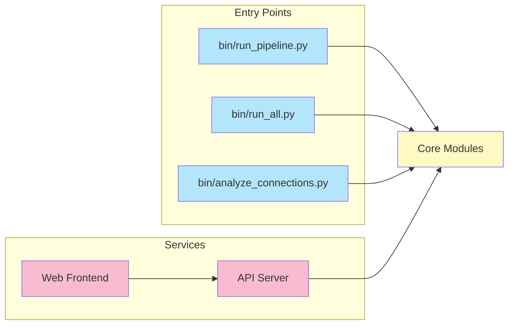

# Installation & Setup Guide

## Installation Flow


## Prerequisites

- Python 3.9+ (Python 3.10+ recommended)
- pip (Python package manager)
- Node.js 18+ (for web frontend)
- Git

## Quick Installation

```bash
# Clone repository
git clone https://github.com/1digitaldesign/kettler-data-analysis.git
cd kettler-data-analysis

# Install Python dependencies
pip install -r requirements.txt

# Configure environment (optional)
cp .env.example .env
# Edit .env with your API keys (GCP, HuggingFace) if needed
```

## Detailed Setup

### 1. Python Environment (Recommended)

```bash
# Create virtual environment
python3 -m venv venv

# Activate virtual environment
# On macOS/Linux:
source venv/bin/activate
# On Windows:
venv\Scripts\activate

# Install dependencies
pip install -r requirements.txt
```

### 2. Environment Configuration

Copy `.env.example` to `.env` and configure:

```bash
cp .env.example .env
```

**Required (if using GCP/Google Drive):**
- `GOOGLE_APPLICATION_CREDENTIALS` - Path to GCP credentials JSON
- `GCP_PROJECT_ID` - Google Cloud Project ID

**Optional:**
- `HUGGINGFACE_TOKEN` - Hugging Face API token (for private models)
- `OPENAI_API_KEY` - OpenAI API key (if using OpenAI models)

### 3. Verify Installation

```bash
# Test Python imports
python3 -c "from scripts.core import UnifiedAnalyzer; print('✓ Core modules OK')"

# Test data paths
python3 -c "from scripts.utils.paths import PROJECT_ROOT; print(f'Project root: {PROJECT_ROOT}')"
```

## System Components



## Running the System

### Command Line

```bash
# Full pipeline
python bin/run_pipeline.py

# Individual components
python bin/run_all.py              # All analyses
python bin/analyze_connections.py   # Connection analysis
python bin/validate_data.py         # Data validation
python bin/generate_reports.py      # Report generation
python bin/clean_data.py            # Data cleaning
```

### API Server

```bash
cd api
python server.py
# API docs: http://localhost:8000/docs
```

### Web Frontend

```bash
cd web
npm install
npm run dev
# Web app: http://localhost:3000
```

## Docker Setup (Alternative)

```bash
# Build and run
docker-compose up -d

# View logs
docker-compose logs -f

# Stop
docker-compose down
```

## Troubleshooting

### Import Errors

If you see import errors:
```bash
# Ensure scripts directory is in Python path
export PYTHONPATH="${PYTHONPATH}:$(pwd)/scripts"
```

### Missing Dependencies

```bash
# Reinstall requirements
pip install --upgrade -r requirements.txt
```

### GCP Authentication

```bash
# Set credentials path
export GOOGLE_APPLICATION_CREDENTIALS="config/gcp-credentials.json"

# Or authenticate interactively
gcloud auth application-default login
```

## Next Steps

- Read [README.md](README.md) for system overview
- See [QUICK_START.md](QUICK_START.md) for usage examples
- Review [docs/INDEX.md](docs/INDEX.md) for full documentation
