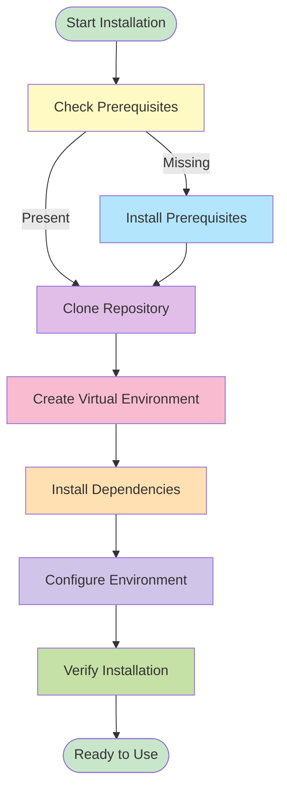
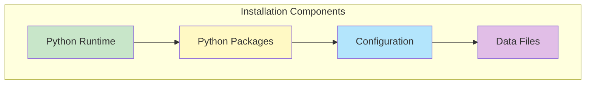

# Installation & Setup Guide


## Installation Flow



## Prerequisites

<details>
<summary><b>Required</b></summary>

- ✅ Python 3.9+ (Python 3.10+ recommended)
- ✅ pip (Python package manager)
- ✅ Git

</details>

<details>
<summary><b>Optional</b></summary>

- Node.js 18+ (for web frontend)
- Docker (for containerized deployment)
- Kubernetes (for production deployment)

</details>

## Quick Installation

```bash
# Clone repository
git clone https://github.com/1digitaldesign/kettler-data-analysis.git
cd kettler-data-analysis

# Install Python dependencies
pip install -r requirements.txt

# Configure environment (optional)
cp .env.example .env
# Edit .env with your API keys (GCP, HuggingFace) if needed
```

## Detailed Installation

<details>
<summary><b>Step 1: Clone Repository</b></summary>

```bash
git clone https://github.com/1digitaldesign/kettler-data-analysis.git
cd kettler-data-analysis
```

</details>

<details>
<summary><b>Step 2: Create Virtual Environment</b> (Recommended)</summary>

```bash
# Create virtual environment
python -m venv venv

# Activate virtual environment
# On macOS/Linux:
source venv/bin/activate
# On Windows:
venv\Scripts\activate
```

</details>

<details>
<summary><b>Step 3: Install Dependencies</b></summary>

```bash
pip install -r requirements.txt
```

**Key Dependencies:**
- `pandas` - Data manipulation
- `transformers` - Hugging Face models
- `fastapi` - API server (optional)
- `uvicorn` - ASGI server (optional)

</details>

<details>
<summary><b>Step 4: Configure Environment</b></summary>

```bash
cp .env.example .env
```

**Environment Variables:**
- `GCP_API_KEY` - Google Cloud Platform API key (optional)
- `HF_API_KEY` - Hugging Face API key (optional)
- `QDRANT_HOST` - Qdrant host (optional)
- `QDRANT_PORT` - Qdrant port (optional)

</details>

<details>
<summary><b>Step 5: Verify Installation</b></summary>

```bash
# Test Python installation
python --version

# Test imports
python -c "import pandas; import transformers; print('✓ Dependencies installed')"

# Run validation
python scripts/utils/validate_schema.py --file data/cleaned/firms.json
```

</details>

## System Components



## Verification

<details>
<summary><b>Check Installation</b></summary>

```bash
# Check Python version
python --version  # Should be 3.9+

# Check installed packages
pip list | grep -E "pandas|transformers|fastapi"

# Test script execution
python bin/run_pipeline.py --help
```

</details>

## Troubleshooting

<details>
<summary><b>Common Issues</b></summary>

**Issue: Python version too old**
```bash
# Install Python 3.9+ using Homebrew (macOS)
brew install python@3.11
```

**Issue: pip install fails**
```bash
# Upgrade pip
pip install --upgrade pip

# Try installing with --user flag
pip install --user -r requirements.txt
```

**Issue: Import errors**
```bash
# Ensure virtual environment is activated
source venv/bin/activate  # macOS/Linux
venv\Scripts\activate     # Windows

# Reinstall dependencies
pip install -r requirements.txt
```

</details>

## Next Steps

1. ✅ **Verify Installation** - Run `python bin/run_pipeline.py --help`
2. 📖 **Read Quick Start** - See [QUICK_START.md](QUICK_START.md)
3. 🚀 **Run Pipeline** - `python bin/run_pipeline.py`
4. 📚 **Explore Documentation** - See [docs/INDEX.md](docs/INDEX.md)

## Related

- [QUICK_START.md](QUICK_START.md) - Quick start guide
- [README.md](README.md) - Project overview
- [docs/INDEX.md](docs/INDEX.md) - Complete documentation index
