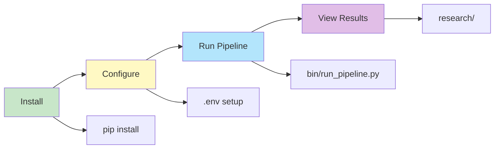
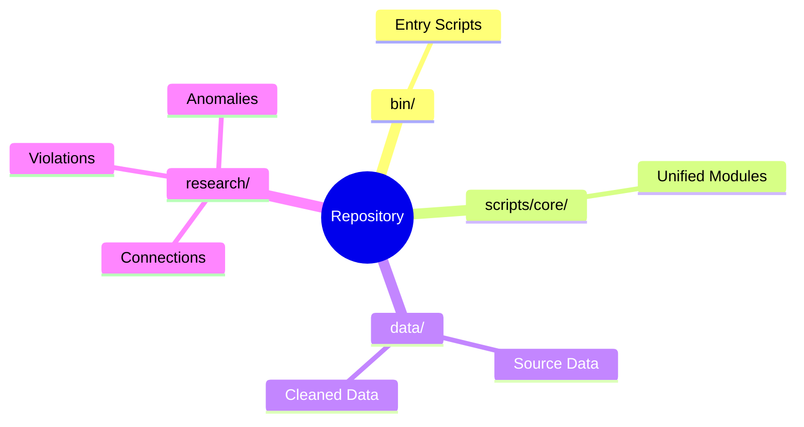

# Quick Start

## Quick Start Flow



## Installation

See [INSTALLATION.md](INSTALLATION.md) for complete setup instructions.

```bash
pip install -r requirements.txt
cp .env.example .env  # Configure as needed
```

## Running

### Pipeline
```bash
python bin/run_pipeline.py
```

### Individual Components
```bash
python bin/run_all.py              # All analyses
python bin/analyze_connections.py   # Connection analysis
python bin/validate_data.py         # Data validation
python bin/generate_reports.py      # Report generation
```

### Web & API
```bash
# API Server
cd api && python server.py  # http://localhost:8000/docs

# Web Frontend
cd web && npm run dev       # http://localhost:3000
```

## Key Directories



- `bin/` - Entry point scripts
- `scripts/core/` - Unified modules (UnifiedAnalyzer, UnifiedSearcher, etc.)
- `data/` - Data files (source, raw, cleaned, vectors)
- `research/` - Research outputs (connections, violations, anomalies)

## Configuration

- `config/state_dpor_registry.csv` - State DPOR registry
- `.env` - Environment variables (GCP, HuggingFace tokens)

## Documentation

- [README.md](README.md) - System overview
- [INSTALLATION.md](INSTALLATION.md) - Installation guide
- [docs/INDEX.md](docs/INDEX.md) - Full documentation index
