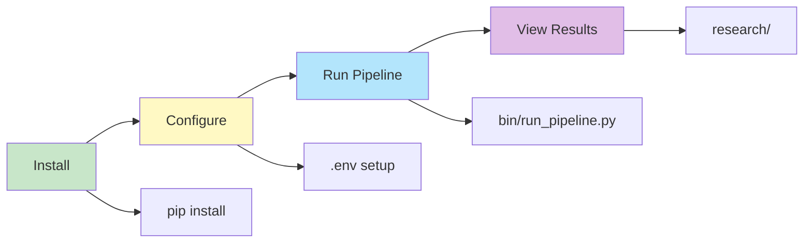

# Quick Start


Get up and running quickly with the Kettler Data Analysis platform.

## Quick Start Flow



## Installation

<details>
<summary><b>Prerequisites</b></summary>

- Python 3.9+ (Python 3.10+ recommended)
- pip (Python package manager)
- Git

</details>

```bash
# Clone repository
git clone https://github.com/1digitaldesign/kettler-data-analysis.git
cd kettler-data-analysis

# Install dependencies
pip install -r requirements.txt

# Configure environment (optional)
cp .env.example .env
```

> 📘 See [INSTALLATION.md](INSTALLATION.md) for complete setup instructions.

## Running

<details>
<summary><b>Full Pipeline</b></summary>

```bash
python bin/run_pipeline.py
```

Runs the complete data processing pipeline:
1. ✅ Data extraction
2. ✅ Data cleaning
3. ✅ Connection analysis
4. ✅ Data validation
5. ✅ Report generation

</details>

<details>
<summary><b>Individual Components</b></summary>

```bash
python bin/run_all.py              # All analyses
python bin/analyze_connections.py   # Connection analysis
python bin/validate_data.py         # Data validation
python bin/generate_reports.py      # Report generation
python bin/clean_data.py           # Data cleaning
python bin/organize_evidence.py    # Evidence organization
```

</details>

<details>
<summary><b>Web & API</b> (Optional)</summary>

**API Server:**
```bash
cd api && python server.py
# http://localhost:8000/docs
```

**Web Frontend:**
```bash
cd web && npm run dev
# http://localhost:3000
```

</details>

## Key Directories

| Directory | Purpose |
|-----------|---------|
| `bin/` | Entry point scripts |
| `scripts/core/` | Unified modules |
| `data/source/` | Source data |
| `data/cleaned/` | Cleaned data |
| `research/` | Research outputs |

## Next Steps

1. ✅ **Run Pipeline** - `python bin/run_pipeline.py`
2. 📊 **View Results** - Check `research/` directory
3. 📖 **Read Documentation** - See [docs/INDEX.md](docs/INDEX.md)
4. 🔍 **Explore Data** - See [data/README.md](data/README.md)

## Troubleshooting

<details>
<summary><b>Common Issues</b></summary>

**Import Errors:**
```bash
# Ensure you're in the project root
cd /path/to/kettler-data-analysis
```

**Missing Dependencies:**
```bash
pip install -r requirements.txt
```

**Python Version:**
```bash
python --version  # Should be 3.9+
```

</details>

## Related

- [INSTALLATION.md](INSTALLATION.md) - Detailed installation guide
- [README.md](README.md) - Project overview
- [docs/INDEX.md](docs/INDEX.md) - Complete documentation index
