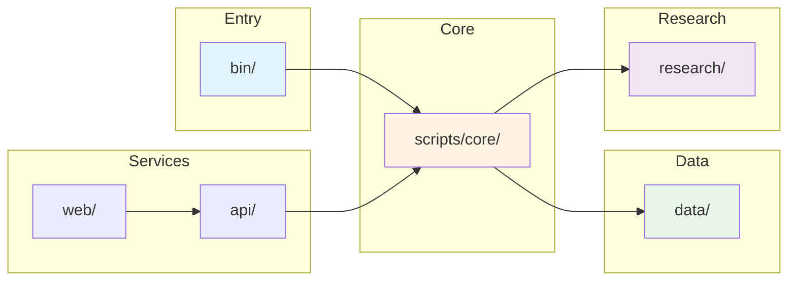

# Kettler Data Analysis

Property management licensing investigation platform. Python-first architecture.

## System Overview

**Purpose:** Multi-state license search, connection analysis, and regulatory compliance investigation.

**Architecture:** Python-first with microservices, unified core modules, and React frontend.

**Data Flow:** Source → Extract → Clean → Analyze → Research Outputs

## Quick Start

**Installation:**
```bash
git clone https://github.com/1digitaldesign/kettler-data-analysis.git
cd kettler-data-analysis
pip install -r requirements.txt
cp .env.example .env  # Configure as needed
```

**Run:**
```bash
python bin/run_pipeline.py
```

See [INSTALLATION.md](INSTALLATION.md) for detailed setup instructions.

## System Structure



**Text Structure:**

```
bin/              # Entry points
scripts/core/     # Unified modules (UnifiedAnalyzer, UnifiedSearcher, etc.)
scripts/analysis/ # Analysis scripts
scripts/etl/      # ETL pipeline
scripts/extraction/ # Evidence extraction
api/              # FastAPI server
web/              # React frontend
microservices/    # Microservice implementations
data/             # Data (source, raw, cleaned, vectors)
research/         # Outputs (connections, violations, anomalies, evidence)
config/           # Configuration
```

## Key Components

**Entry Points:** `bin/run_pipeline.py`, `bin/run_all.py`
**Core Modules:** `scripts/core/unified_*.py`
**API:** `api/server.py` (FastAPI)
**Web:** `web/` (React/TypeScript)
**Microservices:** `microservices/` (API Gateway, Analysis Service, etc.)

## Usage

**Pipeline:**
```bash
python bin/run_pipeline.py
```

**Individual:**
```bash
python bin/run_all.py
python bin/analyze_connections.py
python bin/validate_data.py
```

**API:**
```bash
cd api && python server.py  # http://localhost:8000/docs
```

**Web:**
```bash
cd web && npm run dev  # http://localhost:3000
```

## Documentation

**Getting Started:**
- [INSTALLATION.md](INSTALLATION.md) - Installation and setup guide
- [QUICK_START.md](QUICK_START.md) - Quick start guide

**System Documentation:**
- [docs/SYSTEM_ARCHITECTURE.md](docs/SYSTEM_ARCHITECTURE.md) - System architecture
- [docs/DATA_FLOW.md](docs/DATA_FLOW.md) - Data pipeline
- [docs/COMPONENTS.md](docs/COMPONENTS.md) - Component reference
- [docs/REPOSITORY_STRUCTURE.md](docs/REPOSITORY_STRUCTURE.md) - Repository structure

**Full Documentation:**
- [docs/INDEX.md](docs/INDEX.md) - Complete documentation index

## Data Sources

- `data/source/skidmore_all_firms_complete.json` - Firm data (38 firms)
- `research/connections/` - Connection analyses
- `research/violations/` - Violation findings
- `research/anomalies/` - Anomaly reports

## Features

- Multi-state license search
- Connection mapping
- Anomaly detection
- Evidence extraction (PDF/Excel)
- Vector embeddings
- Timeline analysis
