# Kettler Data Analysis

Property management licensing investigation platform. Python-first architecture.


**Last Updated:** December 10, 2025

---

## About this project

This platform helps investigate property management licensing compliance across multiple states. It searches licenses, analyzes connections between firms and individuals, and generates research outputs for regulatory compliance investigations.

**What you can do:**
- Search licenses across 15 states
- Map connections between firms and individuals
- Detect anomalies and violations
- Extract evidence from PDFs and Excel files
- Generate comprehensive research reports

---

## Quick Start

Choose your path based on what you need to do:

<details>
<summary><b>Filing administrative complaints</b></summary>

Start here if you're preparing regulatory complaints:

- [VA DPOR Complaint Files](research/va_dpor_complaint/) - Complete complaint research
- [Research Index](research/research_index.json) - Master research index
- [Research README](research/README.md) - Research directory guide

</details>

<details>
<summary><b>Understanding findings</b></summary>

Start here to explore research results:

- [Research Index](research/RESEARCH_INDEX.json) - Master file index
- [VA DPOR Complaint Files](research/va_dpor_complaint/) - Complaint research
- [Research Reports](research/reports/) - Summary reports

</details>

<details>
<summary><b>Data analysis</b></summary>

Start here for data exploration:

- [Firm Data](data/source/skidmore_all_firms_complete.json) - 38 firms
- [Connections](research/connections/) - Connection analyses
- [Research Reports](research/reports/) - Analysis reports

</details>

---

## System overview

### Architecture Diagram

```mermaid
graph TB
    subgraph "Data Sources"
        A["📁 Source Files<br/><a href='data/source/'>View Data</a>"]
        B["📊 Research Data<br/><a href='research/'>Explore Research</a>"]
        C["🔍 License Databases<br/><a href='research/license_searches/'>Search Licenses</a>"]
    end

    subgraph "ETL Pipeline"
        D["📥 Extract"]
        E["🔄 Transform"]
        F["💾 Load"]
    end

    subgraph "Analysis"
        G["🔗 Connection Analysis<br/><a href='scripts/analysis/'>View Scripts</a>"]
        H["📈 Graph Theory<br/><a href='data/processed/graph_theory_analysis.json'>View Analysis</a>"]
        I["🤖 ML Pipeline<br/><a href='scripts/analysis/advanced_ml_pipeline.py'>View Pipeline</a>"]
    end

    subgraph "Outputs"
        J["📄 Research Reports<br/><a href='research/reports/'>View Reports</a>"]
        K["📊 Visualizations<br/><a href='data/processed/'>View Data</a>"]
        L["✅ Compliance Data<br/><a href='data/processed/cross_referenced_violations.json'>View Violations</a>"]
    end

    A --> D
    B --> D
    C --> D
    D --> E
    E --> F
    F --> G
    F --> H
    F --> I
    G --> J
    H --> K
    I --> L

    style A fill:#fbbf24,stroke:#f59e0b,stroke-width:3px
    style B fill:#fbbf24,stroke:#f59e0b,stroke-width:3px
    style C fill:#fbbf24,stroke:#f59e0b,stroke-width:3px
    style D fill:#60a5fa,stroke:#3b82f6,stroke-width:3px
    style E fill:#60a5fa,stroke:#3b82f6,stroke-width:3px
    style F fill:#60a5fa,stroke:#3b82f6,stroke-width:3px
    style G fill:#34d399,stroke:#10b981,stroke-width:3px
    style H fill:#34d399,stroke:#10b981,stroke-width:3px
    style I fill:#34d399,stroke:#10b981,stroke-width:3px
    style J fill:#4ade80,stroke:#22c55e,stroke-width:3px
    style K fill:#4ade80,stroke:#22c55e,stroke-width:3px
    style L fill:#4ade80,stroke:#22c55e,stroke-width:3px
```



### System Components

| Aspect | Description |
|--------|-------------|
| **Purpose** | Multi-state license search, connection analysis, and regulatory compliance investigation |
| **Architecture** | Python-first with unified core modules, ETL pipeline, and optional API/web frontend |
| **Data Flow** | Source → Extract → Clean → Analyze → Research Outputs |
| **Processing** | Parallel processing with 32 workers (ARM M4 MAX optimized) |
| **Throughput** | ~5,000 files/second processing speed |

---

## Installation

Install dependencies and run the pipeline:

```bash
git clone https://github.com/1digitaldesign/kettler-data-analysis.git
cd kettler-data-analysis
pip install -r requirements.txt
python bin/run_pipeline.py
```

> See [INSTALLATION.md](INSTALLATION.md) for detailed setup instructions.

**Requirements:** Python 3.14 or higher

---

## Usage

### Run the full pipeline

```bash
python bin/run_pipeline.py
```

This runs the complete data processing pipeline:

1. Data extraction
2. Data cleaning
3. Connection analysis
4. Data validation
5. Report generation

### Run individual scripts

```bash
python bin/analyze_connections.py  # Connection analysis
python bin/validate_data.py        # Data validation
python bin/clean_data.py          # Data cleaning
python bin/generate_reports.py    # Report generation
```

---

## Documentation

### Getting started

- [INSTALLATION.md](INSTALLATION.md) - Setup guide
- [QUICK_START.md](QUICK_START.md) - Quick start
- [STATUS.md](STATUS.md) - Current status

### System documentation

- [System Architecture](docs/SYSTEM_ARCHITECTURE.md) - Complete architecture (components, data flow, structure, diagrams)
- [Repository Structure](docs/REPOSITORY_STRUCTURE.md) - Detailed file organization
- [System Analyst Guide](docs/SYSTEM_ANALYST_GUIDE.md) - System analyst guide

### Data documentation

**Data structure:**
- [Schema](data/schema.json) - FK/PK relationships
- [Data Dictionary](data/DATA_DICTIONARY.md) - Field definitions
- [Ontology](data/ONTOLOGY.md) - Conceptual relationships
- [Ancestry](data/ANCESTRY.md) - Data lineage
- [Metadata](data/metadata.json) - Global metadata

**Data governance:**
- [Data Catalog](data/DATA_CATALOG.md) - Comprehensive data catalog (discoverability, metadata, quality)
- [Data Governance](data/GOVERNANCE.md) - Governance framework (policies, compliance, security)

### Documentation index

- [Documentation Index](docs/INDEX.md) - All documentation
- [Documentation Graph](docs/DOCUMENTATION_GRAPH.md) - Interactive documentation network

**Documentation network:**


---

## Research status


**Status:** 100% complete. All critical areas documented, evidence compiled, ready for complaint filing.

### Statistics

| Metric | Value | Status |
|--------|-------|--------|
| **Total Files** | 350 JSON + 30 MD | ✅ Complete |
| **Research Categories** | 19 categories | ✅ Categorized |
| **License Searches** | 285 files across 15 states | ✅ Searched |
| **Firms** | 38 firms | ✅ Analyzed |
| **Individual Licenses** | 40+ licenses | ✅ Documented |
| **Connections** | 100+ connections | ✅ Mapped |
| **Processing Speed** | ~5,000 files/second | 🚀 Optimized |
| **Data Quality** | 99.3% | ✅ Excellent |

### Research Distribution


### Key findings

| Finding | Value | Impact |
|--------|-------|--------|
| **Regulatory Violations** | 8 violations across 11 states | 🔴 Critical |
| **Principal Broker Gap** | 10.5 years | ⚠️ Significant |
| **Geographic Violation** | 1,300 miles | 🔴 Critical |
| **Unlicensed Personnel** | 16 (7 property managers) | ⚠️ High Risk |
| **Property Value Managed** | $4.75B | 💰 Substantial |

### Violation Analysis

```mermaid
graph LR
    A["🚨 8 Violations<br/><a href='data/processed/cross_referenced_violations.json'>View Details</a>"] --> B["🗺️ 11 States<br/><a href='research/company_registrations/'>View States</a>"]
    A --> C["⚠️ 16 Unlicensed<br/><a href='research/analysis/'>View Analysis</a>"]
    A --> D["💰 $4.75B Property<br/><a href='research/financial/'>View Financial</a>"]

    B --> E["⚖️ Regulatory Risk<br/><a href='research/reports/'>View Reports</a>"]
    C --> E
    D --> E

    style A fill:#ef4444,stroke:#dc2626,stroke-width:4px
    style B fill:#f59e0b,stroke:#d97706,stroke-width:3px
    style C fill:#f59e0b,stroke:#d97706,stroke-width:3px
    style D fill:#f59e0b,stroke:#d97706,stroke-width:3px
    style E fill:#dc2626,stroke:#991b1b,stroke-width:4px
```



---

## System structure

### Directory Structure


### Component Breakdown

| Directory | Purpose | Files |
|-----------|---------|-------|
| **bin/** | Entry points and executables | Pipeline scripts |
| **scripts/core/** | Unified core modules | Shared utilities |
| **scripts/analysis/** | Analysis scripts | ML, graph theory, violations |
| **scripts/etl/** | ETL pipeline | Data processing |
| **data/** | All data files | Source, processed, vectors |
| **research/** | Research outputs | 6,085+ JSON files |
| **docs/** | Documentation | Architecture, guides |

---

## Features

### Core Capabilities


### Feature Matrix

| Feature | Status | Performance |
|---------|--------|-------------|
| **Multi-state License Search** | ✅ Complete | 15 states covered |
| **Connection Mapping** | ✅ Complete | Graph theory analysis |
| **Anomaly Detection** | ✅ Complete | ML-enhanced detection |
| **Evidence Extraction** | ✅ Complete | PDF/Excel support |
| **Vector Embeddings** | ✅ Complete | Semantic search ready |
| **Timeline Analysis** | ✅ Complete | Temporal patterns |
| **Schema Validation** | ✅ Complete | 99.3% quality score |

---

**Research Status:** 100% Complete - Ready for Complaint Filing
