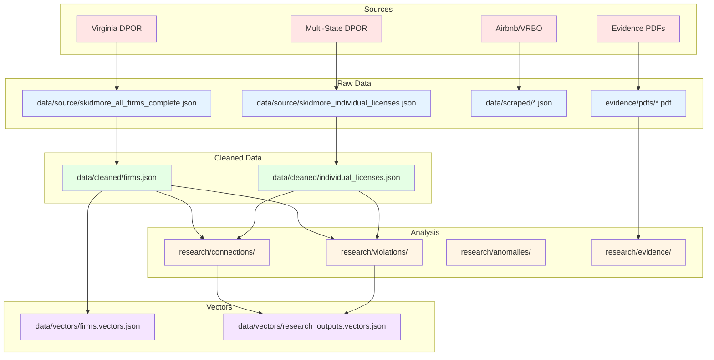

# Data Ancestry


Complete data lineage documenting the origin, transformations, and dependencies of all data.

## Overview

This document tracks the **lineage** of data from original sources through transformations to final research outputs.

**Answers:** Where did this data come from? How was it transformed?

## Data Flow Pipeline


## Source Data

<details>
<summary><b>1. Virginia DPOR Firm Licenses</b></summary>

**Source:** Virginia Department of Professional and Occupational Regulation (DPOR)
**Collection Method:** Web scraping / manual search
**Original Format:** HTML/CSV
**Collection Date:** 2024-2025

**Files:**
- `data/source/skidmore_all_firms_complete.json` (38 firms)
- `data/source/skidmore_firms_database.csv` (CSV export)

**Transformation:**
- **Script:** `bin/clean_data.py`
- **Functions:** `clean_firm_names()`, `normalize_addresses()`, `parse_dates()`
- **Output:** `data/cleaned/firms.json`

**Changes:**
- ✅ Normalized firm names (uppercase, trimmed)
- ✅ Standardized addresses (uppercase, normalized abbreviations)
- ✅ Parsed dates (ISO 8601 format: `YYYY-MM-DD`)
- ✅ Extracted license numbers (10-digit format)
- ✅ Added `gap_years` calculation

**Lineage:**
```
Virginia DPOR Website
  → data/source/skidmore_all_firms_complete.json (raw)
  → bin/clean_data.py::clean_firm_names()
  → bin/clean_data.py::normalize_addresses()
  → bin/clean_data.py::parse_dates()
  → data/cleaned/firms.json (cleaned)
```

</details>

<details>
<summary><b>2. Individual Licenses (Multi-State)</b></summary>

**Source:** Multiple state DPOR databases (VA, TX, NC, MD, etc.)
**Collection Method:** Multi-state search scripts
**Original Format:** HTML/JSON
**Collection Date:** 2024-2025

**Files:**
- `data/source/skidmore_individual_licenses.json` (40+ licenses)
- `data/source/skidmore_individual_licenses.csv` (CSV export)

**Transformation:**
- **Script:** `bin/clean_data.py`
- **Functions:** `extract_entities()`, `deduplicate_results()`
- **Output:** `data/cleaned/individual_licenses.json`

**Changes:**
- ✅ Normalized names (uppercase, standardized format)
- ✅ Parsed license numbers (10-digit format)
- ✅ Standardized addresses
- ✅ Removed duplicates (same license number, different states)
- ✅ Added state codes

**Lineage:**
```
Multi-State DPOR Searches
  → data/raw/*.json (raw search results)
  → bin/clean_data.py::extract_entities()
  → bin/clean_data.py::deduplicate_results()
  → data/cleaned/individual_licenses.json (cleaned)
```

</details>

<details>
<summary><b>3. Scraped Data (STR Listings, etc.)</b></summary>

**Source:** Airbnb, VRBO, Front Website, etc.
**Collection Method:** Web scraping scripts
**Original Format:** JSON
**Collection Date:** 2024-2025

**Files:**
- `data/scraped/airbnb_listings_john_carlyle.json`
- `data/scraped/vrbo_listings_john_carlyle.json`
- `data/scraped/front_website_listings.json`
- `data/scraped/additional_str_listings.json`

**Transformation:**
- **Script:** `scripts/automation/*.js` (DevTools scrapers)
- **Output:** Direct to `data/scraped/` (no cleaning step)

**Changes:** None (raw scraped data preserved)

</details>

## Transformation Steps

<details>
<summary><b>Step 1: Data Cleaning</b> (`bin/clean_data.py`)</summary>

**Purpose:** Standardize and normalize raw data
**Input:** `data/raw/`, `data/source/`
**Output:** `data/cleaned/`

**Functions:**
- `clean_firm_names()` - Normalize firm names
- `normalize_addresses()` - Standardize addresses
- `parse_dates()` - Parse and format dates
- `extract_entities()` - Extract entities using Hugging Face transformers
- `deduplicate_results()` - Remove duplicates

**Dependencies:**
- `pandas` - Data manipulation
- `transformers` (Hugging Face) - Entity extraction
- `re` - Regex pattern matching

**Output Files:**
- `data/cleaned/firms.json`
- `data/cleaned/individual_licenses.json`

</details>

<details>
<summary><b>Step 2: Connection Analysis</b> (`bin/analyze_connections.py`)</summary>

**Purpose:** Identify connections between firms and individuals
**Input:** `data/cleaned/firms.json`, `data/cleaned/individual_licenses.json`
**Output:** `research/connections/`

**Functions:**
- `find_principal_broker_connections()` - Match firms to principal brokers
- `find_address_connections()` - Find firms sharing addresses
- `find_firm_name_connections()` - Match firm names
- `generate_connection_matrix()` - Create connection matrix

**Dependencies:**
- `scripts/core/unified_analysis.py` - UnifiedAnalyzer
- `scripts/utils/paths.py` - Path utilities

**Output Files:**
- `research/connections/caitlin_skidmore_connections.json`
- `research/connections/dpor_skidmore_connections.csv`
- `research/analysis/connection_matrix.json`

</details>

<details>
<summary><b>Step 3: Data Validation</b> (`bin/validate_data.py`)</summary>

**Purpose:** Validate data quality and integrity
**Input:** `data/cleaned/`, `research/connections/`
**Output:** `research/verification/`, `research/summaries/`

**Functions:**
- `validate_license_numbers()` - Check license number format
- `validate_fk_references()` - Validate foreign key relationships
- `check_duplicates()` - Identify duplicates
- `validate_addresses()` - Validate address format
- `validate_dates()` - Check date ranges

**Dependencies:**
- `scripts/utils/validate_schema.py` - Schema validation
- `data/schema.json` - Schema definition

**Output Files:**
- `research/verification/dpor_validated.json`
- `research/summaries/data_quality_report.json`

</details>

<details>
<summary><b>Step 4: ETL Pipeline</b> (`scripts/etl/etl_pipeline.py`)</summary>

**Purpose:** Generate vector embeddings for semantic search
**Input:** `data/cleaned/`, `research/`
**Output:** `data/vectors/`

**Functions:**
- `load_all_data()` - Load cleaned data and research outputs
- `generate_embeddings()` - Create vector embeddings
- `store_vectors()` - Store in vector database
- `create_index()` - Create search index

**Dependencies:**
- `transformers` (Hugging Face) - Embedding models
- Vector database (e.g., FAISS, Pinecone)

**Output Files:**
- `data/vectors/firms.vectors.json`
- `data/vectors/individual_licenses.vectors.json`
- `data/vectors/research_outputs.vectors.json`
- `data/vectors/processed_files.json`

</details>

<details>
<summary><b>Step 5: Research Analysis</b> (`scripts/core/unified_analysis.py`)</summary>

**Purpose:** Generate research outputs and findings
**Input:** `data/cleaned/`, `research/connections/`
**Output:** `research/` (various categories)

**Functions:**
- `analyze_violations()` - Identify regulatory violations
- `analyze_anomalies()` - Find anomalies
- `analyze_timelines()` - Timeline analysis
- `generate_summaries()` - Create summary reports

**Dependencies:**
- `scripts/core/unified_investigation.py` - UnifiedInvestigator
- `scripts/analysis/analyze_fraud_patterns.py` - Fraud pattern analysis

**Output Files:**
- `research/violations/*.json`
- `research/anomalies/*.json`
- `research/timelines/*.json`
- `research/summaries/*.json`

</details>

<details>
<summary><b>Step 6: Evidence Extraction</b> (`bin/organize_evidence.py`)</summary>

**Purpose:** Extract entities from evidence documents
**Input:** `evidence/` (PDFs, Excel files)
**Output:** `research/evidence/`

**Functions:**
- `extract_pdf_entities()` - Extract from PDFs
- `extract_excel_data()` - Extract from Excel files
- `package_evidence()` - Create evidence packages

**Dependencies:**
- PDF parsing libraries
- `pandas` - Excel parsing
- `transformers` - Entity extraction

**Output Files:**
- `research/evidence/pdf_evidence_extracted.json`
- `research/evidence/excel_evidence_extracted.json`
- `research/evidence/upl_evidence_extracted.json`

</details>

## Complete Data Lineage Diagram



## Processing Scripts

| Script | Purpose | Input | Output |
|--------|---------|-------|--------|
| `bin/clean_data.py` | Clean and normalize data | `data/source/`, `data/raw/` | `data/cleaned/` |
| `bin/analyze_connections.py` | Find connections | `data/cleaned/` | `research/connections/` |
| `scripts/core/unified_analysis.py` | Unified analysis | `data/cleaned/`, `research/connections/` | `research/violations/`, `research/anomalies/` |
| `bin/validate_data.py` | Validate data quality | `data/cleaned/` | `research/verification/` |
| `scripts/etl/etl_pipeline.py` | Generate vectors | `data/cleaned/`, `research/` | `data/vectors/` |
| `bin/organize_evidence.py` | Extract evidence | `evidence/` | `research/evidence/` |

## Data Timestamps

| Stage | Date Range |
|-------|------------|
| **Collection** | 2024-10-31 to 2025-12-07 |
| **Processing** | 2025-12-07 |
| **Analysis** | 2025-12-07 |
| **Research** | 2025-12-07 |

## Data Versions

| Version | Date | Description |
|---------|------|-------------|
| **v1.0** | 2025-12-07 | Initial comprehensive data collection and analysis |

## Related Documentation

### Data documentation
- 📚 [Data Catalog](./DATA_CATALOG.md) - Data asset catalog and discoverability
- 🛡️ [Data Governance](./GOVERNANCE.md) - Governance framework and policies
- 📋 [Data Dictionary](./DATA_DICTIONARY.md) - Field definitions
- 🧠 [Data Ontology](./ONTOLOGY.md) - Conceptual relationships
- 📊 [Schema Definition](./schema.json) - FK/PK relationships
- 📄 [Metadata Schema](./metadata.json) - Metadata structure definition
- 📁 [Data README](./README.md) - Data directory guide

### System documentation
- 📑 [Documentation Index](../docs/INDEX.md) - Complete documentation index
- 🏗️ [System Architecture](../docs/SYSTEM_ARCHITECTURE.md) - System architecture overview
- 📁 [Repository Structure](../docs/REPOSITORY_STRUCTURE.md) - File organization
