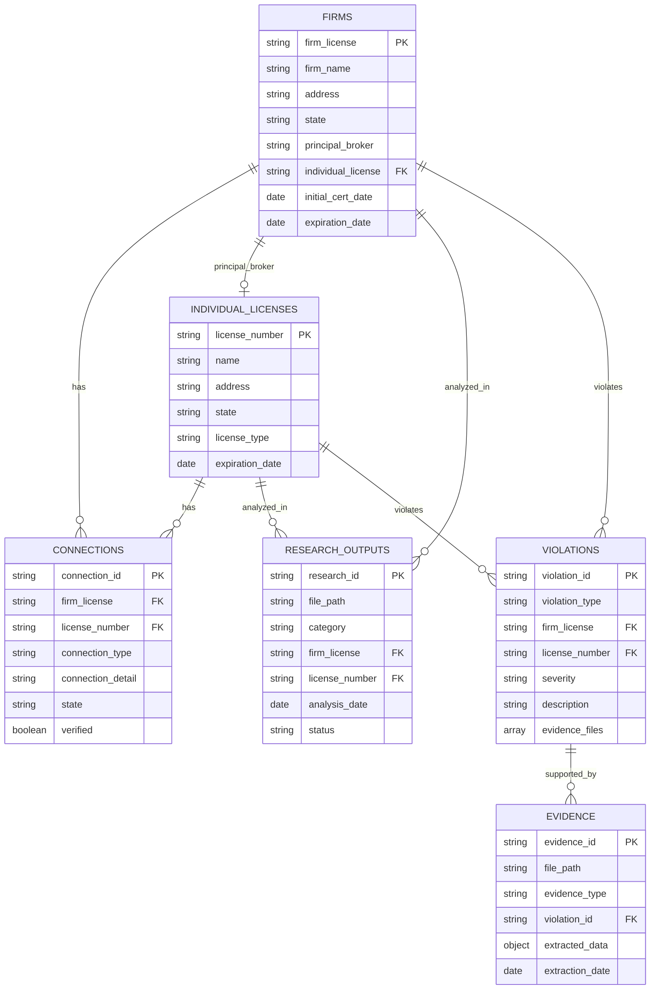

# Data Dictionary

Complete field definitions, types, constraints, and examples for all data entities.

## 📋 Table of Contents

- [Firms](#firms)
- [Individual Licenses](#individual-licenses)
- [Connections](#connections)
- [Research Outputs](#research-outputs)
- [Violations](#violations)
- [Evidence](#evidence)
- [Entity-Relationship Diagram](#entity-relationship-diagram)

---

## 🏢 Firms

<b>Table Details</b>

- **Table:** `firms`
- **Primary Key:** `firm_license`
- **Source File:** `data/cleaned/firms.json`
- **Description:** Real estate firm licenses from Virginia DPOR
- **Records:** 38 firms

### Fields

| Field Name | Type | Required | Unique | Format | Description | Example |
|------------|------|----------|--------|--------|-------------|---------|
| `firm_license` | string | ✅ Yes | ✅ Yes | `^[0-9]{10}$` | 10-digit Virginia DPOR license number (PK) | `"0226025311"` |
| `firm_name` | string | ✅ Yes | ❌ No | - | Legal name of the firm | `"KETTLER MANAGEMENT INC"` |
| `license_type` | string | ✅ Yes | ❌ No | - | Type of license | `"Real Estate Firm License"` |
| `firm_type` | string | ❌ No | ❌ No | - | Legal entity type | `"Corporation"` |
| `address` | string | ✅ Yes | ❌ No | - | Business address | `"8255 GREENSBORO DR STE 200, MCLEAN, VA 22102"` |
| `state` | string | ✅ Yes | ❌ No | `^[A-Z]{2}$` | Two-letter state code | `"VA"` |
| `principal_broker` | string | ✅ Yes | ❌ No | - | Name of principal broker | `"SKIDMORE CAITLIN MARIE"` |
| `initial_cert_date` | string | ❌ No | ❌ No | `YYYY-MM-DD` | Initial certification date | `"2014-10-31"` |
| `expiration_date` | string | ❌ No | ❌ No | `YYYY-MM-DD` | License expiration date | `"2026-10-31"` |
| `individual_license` | string | ❌ No | ❌ No | `^[0-9]{10}$` | FK to `individual_licenses.license_number` | `"0225258285"` |
| `gap_years` | number | ❌ No | ❌ No | - | Years between firm license and principal broker license | `11` |

### Constraints

- ✅ `firm_license` must be unique and exactly 10 digits
- ✅ `principal_broker` cannot be null
- ✅ `address` cannot be null
- ✅ `firm_name` cannot be null

### Foreign Keys

- `individual_license` → `individual_licenses.license_number` (optional, many-to-one)

---

## 👤 Individual Licenses

<b>Table Details</b>

- **Table:** `individual_licenses`
- **Primary Key:** `license_number`
- **Source File:** `data/cleaned/individual_licenses.json`
- **Description:** Individual real estate licenses
- **Records:** 40+ licenses

### Fields

| Field Name | Type | Required | Unique | Format | Description | Example |
|------------|------|----------|--------|--------|-------------|---------|
| `license_number` | string | ✅ Yes | ✅ Yes | `^[0-9]{10}$` | 10-digit license number (PK) | `"0225258285"` |
| `name` | string | ✅ Yes | ❌ No | - | License holder name | `"SKIDMORE, CAITLIN MARIE"` |
| `address` | string | ❌ No | ❌ No | - | Address associated with license | `"FRISCO, TX 75034"` |
| `license_type` | string | ✅ Yes | ❌ No | - | Type of license | `"Real Estate Individual"` |
| `board` | string | ❌ No | ❌ No | - | Regulatory board | `"Real Estate Board"` |
| `state` | string | ✅ Yes | ❌ No | `^[A-Z]{2}$` | Two-letter state code | `"TX"` |
| `expiration_date` | string | ❌ No | ❌ No | `YYYY-MM-DD` | License expiration date | `"2026-10-31"` |

### Constraints

- ✅ `license_number` must be unique and exactly 10 digits
- ✅ `name` cannot be null
- ✅ `state` must be a valid 2-letter state code

---

## 🔗 Connections

<b>Table Details</b>

- **Table:** `connections`
- **Primary Key:** `connection_id`
- **Source File:** `research/connections/caitlin_skidmore_connections.json`
- **Description:** Connections between firms and individuals
- **Records:** 100+ connections

### Fields

| Field Name | Type | Required | Unique | Format | Description | Example |
|------------|------|----------|--------|--------|-------------|---------|
| `connection_id` | string | ✅ Yes | ✅ Yes | `^[a-f0-9]{32}$` | Auto-generated connection ID (PK) | `"abc123def456..."` |
| `firm_license` | string | ❌ No | ❌ No | `^[0-9]{10}$` | FK to `firms.firm_license` | `"0226025311"` |
| `license_number` | string | ❌ No | ❌ No | `^[0-9]{10}$` | FK to `individual_licenses.license_number` | `"0225258285"` |
| `connection_type` | string | ✅ Yes | ❌ No | enum | Type of connection | `"Principal Broker"` |
| `connection_detail` | string | ❌ No | ❌ No | - | Detailed description | `"Listed as Principal Broker"` |
| `state` | string | ❌ No | ❌ No | `^[A-Z]{2}$` | State where connection exists | `"VA"` |
| `verified` | boolean | ❌ No | ❌ No | - | Whether connection has been verified | `false` |
| `analysis_date` | string | ❌ No | ❌ No | `YYYY-MM-DD` | Date connection was identified | `"2025-12-07"` |

### Connection Types

<b>Enum Values</b>

- `"Principal Broker"` - Individual is listed as principal broker
- `"Same Address"` - Firms share the same address
- `"Same Address as Known Firm"` - Address matches a known firm
- `"Known Firm Match"` - Direct firm match
- `"Professional Association"` - Professional relationship
- `"Corporate Relationship"` - Corporate connection

---

## 📊 Research Outputs

<b>Table Details</b>

- **Table:** `research_outputs`
- **Primary Key:** `research_id`
- **Source File:** `research/` (multiple files)
- **Description:** Research analysis outputs and findings
- **Records:** 350+ files

### Fields

| Field Name | Type | Required | Unique | Format | Description | Example |
|------------|------|----------|--------|--------|-------------|---------|
| `research_id` | string | ✅ Yes | ✅ Yes | `^[a-f0-9]{32}$` | Auto-generated research ID (PK) | `"def456ghi789..."` |
| `file_path` | string | ✅ Yes | ✅ Yes | - | Relative path to research file | `"research/connections/..."` |
| `category` | string | ✅ Yes | ❌ No | enum | Research category | `"connections"` |
| `firm_license` | string | ❌ No | ❌ No | `^[0-9]{10}$` | FK to `firms.firm_license` | `"0226025311"` |
| `license_number` | string | ❌ No | ❌ No | `^[0-9]{10}$` | FK to `individual_licenses.license_number` | `"0225258285"` |
| `analysis_date` | string | ❌ No | ❌ No | `YYYY-MM-DD` | Date analysis was performed | `"2025-12-07"` |
| `findings_summary` | string | ❌ No | ❌ No | - | Brief summary of findings | `"Found 38 firms..."` |
| `status` | string | ❌ No | ❌ No | enum | Research status | `"complete"` |

### Categories

<b>Enum Values</b>

- `"connections"` - Connection analyses
- `"violations"` - Violation findings
- `"anomalies"` - Anomaly reports
- `"evidence"` - Evidence documents
- `"verification"` - Verification results
- `"timelines"` - Timeline analyses
- `"summaries"` - Summary reports
- `"search_results"` - Search results
- `"analysis"` - General analysis outputs
- `"va_dpor_complaint"` - VA DPOR complaint research

---

## ⚠️ Violations

<b>Table Details</b>

- **Table:** `violations`
- **Primary Key:** `violation_id`
- **Source File:** `research/violations/` (multiple files)
- **Description:** Regulatory violations identified
- **Records:** 8+ violations

### Fields

| Field Name | Type | Required | Unique | Format | Description | Example |
|------------|------|----------|--------|--------|-------------|---------|
| `violation_id` | string | ✅ Yes | ✅ Yes | `^[a-f0-9]{32}$` | Auto-generated violation ID (PK) | `"ghi789jkl012..."` |
| `violation_type` | string | ✅ Yes | ❌ No | enum | Type of violation | `"Principal Broker Gap"` |
| `firm_license` | string | ❌ No | ❌ No | `^[0-9]{10}$` | FK to `firms.firm_license` | `"0226025311"` |
| `license_number` | string | ❌ No | ❌ No | `^[0-9]{10}$` | FK to `individual_licenses.license_number` | `"0225258285"` |
| `severity` | string | ❌ No | ❌ No | enum | Violation severity | `"High"` |
| `description` | string | ✅ Yes | ❌ No | - | Detailed description | `"Firm licensed 10.5 years..."` |
| `evidence_files` | array[string] | ❌ No | ❌ No | - | List of evidence file paths | `["research/va_dpor_complaint/..."]` |
| `state` | string | ❌ No | ❌ No | `^[A-Z]{2}$` | State where violation occurred | `"VA"` |
| `identified_date` | string | ❌ No | ❌ No | `YYYY-MM-DD` | Date violation was identified | `"2025-12-07"` |

### Violation Types

<b>Enum Values</b>

- `"Principal Broker Gap"` - Firm licensed before principal broker
- `"Geographic Violation"` - Geographic impossibility
- `"Supervision Impossibility"` - Cannot supervise from location
- `"Unlicensed Practice"` - Practice without license
- `"Timeline Impossibility"` - Timeline conflicts
- `"Regulatory Violation"` - General regulatory violation
- `"50-Mile Rule Violation"` - Violation of 50-mile supervision rule

---

## 📄 Evidence

<b>Table Details</b>

- **Table:** `evidence`
- **Primary Key:** `evidence_id`
- **Source File:** `evidence/` (multiple files)
- **Description:** Evidence documents and extracted data
- **Records:** 10+ evidence files

### Fields

| Field Name | Type | Required | Unique | Format | Description | Example |
|------------|------|----------|--------|--------|-------------|---------|
| `evidence_id` | string | ✅ Yes | ✅ Yes | `^[a-f0-9]{32}$` | Auto-generated evidence ID (PK) | `"jkl012mno345..."` |
| `file_path` | string | ✅ Yes | ❌ No | - | Path to evidence file | `"evidence/pdfs/..."` |
| `evidence_type` | string | ✅ Yes | ❌ No | enum | Type of evidence | `"PDF"` |
| `violation_id` | string | ❌ No | ❌ No | `^[a-f0-9]{32}$` | FK to `violations.violation_id` | `"ghi789jkl012..."` |
| `extracted_data` | object | ❌ No | ❌ No | - | Extracted entities and data | `{"entities": []}` |
| `extraction_date` | string | ❌ No | ❌ No | `YYYY-MM-DD` | Date evidence was extracted | `"2025-12-07"` |
| `source` | string | ❌ No | ❌ No | - | Source of evidence | `"Lease termination document"` |

### Evidence Types

<b>Enum Values</b>

- `"PDF"` - PDF document
- `"Excel"` - Excel spreadsheet
- `"Email"` - Email correspondence
- `"Legal Document"` - Legal document
- `"LinkedIn Profile"` - LinkedIn profile
- `"Web Page"` - Web page
- `"Correspondence"` - General correspondence

---

## Entity-Relationship Diagram

## Related Documentation

### Data documentation
- 📚 [Data Catalog](./DATA_CATALOG.md) - Data asset catalog and discoverability
- 🛡️ [Data Governance](./GOVERNANCE.md) - Governance framework and policies
- 📋 [Schema Definition](./schema.json) - Complete JSON schema
- 🧠 [Data Ontology](./ONTOLOGY.md) - Conceptual relationships
- 🔗 [Data Ancestry](./ANCESTRY.md) - Data lineage and transformations
- 📄 [Metadata Schema](./metadata.json) - Metadata structure definition
- 📁 [Data README](./README.md) - Data directory guide

### System documentation
- 📑 [Documentation Index](../docs/INDEX.md) - Complete documentation index
- 🏗️ [System Architecture](../docs/SYSTEM_ARCHITECTURE.md) - System architecture overview
- 📁 [Repository Structure](../docs/REPOSITORY_STRUCTURE.md) - File organization
