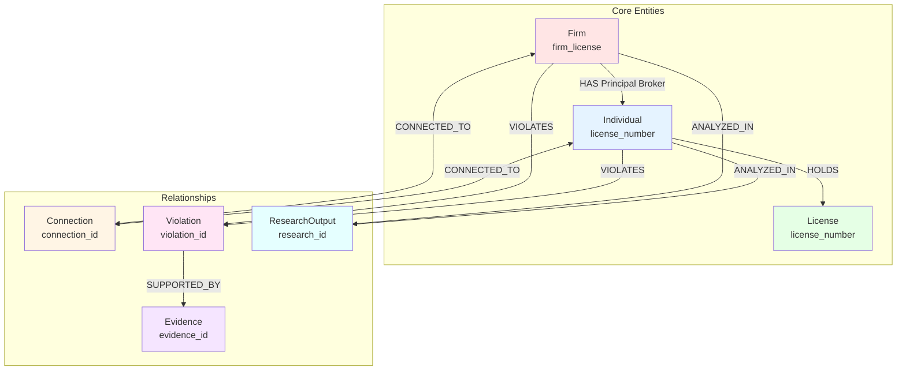

# Data Ontology

Conceptual model defining core entities, relationships, and properties in the Kettler Data Analysis domain.

## Overview

This ontology describes the semantic structure of the data, focusing on **what** entities exist, **how** they relate to each other, and **what properties** they possess. It complements the [Data Dictionary](./DATA_DICTIONARY.md) (which focuses on technical field definitions) and the [Schema](./schema.json) (which focuses on FK/PK relationships).

## Core Concepts

### Entity Types

#### 1. **Firm** (`Firm`)
A licensed real estate firm entity.

**Properties:**
- Has a unique license number (10-digit Virginia DPOR)
- Has a legal name
- Has a business address
- Has a principal broker (Individual)
- Has license dates (initial certification, expiration)
- Operates in a state

**Key Characteristics:**
- Primary identifier: `firm_license`
- Can have multiple connections to other firms
- Can be associated with violations
- Can be analyzed in research outputs

#### 2. **Individual** (`Individual`)
A person holding a real estate license.

**Properties:**
- Has a unique license number (10-digit)
- Has a name
- Has an address
- Holds a license type
- Licensed by a regulatory board
- Operates in a state
- Has license expiration date

**Key Characteristics:**
- Primary identifier: `license_number`
- Can be a principal broker for firms
- Can have multiple licenses (different states/types)
- Can be connected to firms
- Can be associated with violations

#### 3. **License** (`License`)
A regulatory authorization to practice real estate.

**Properties:**
- Has a license number
- Has a type (Firm or Individual)
- Has a state jurisdiction
- Has dates (certification, expiration)
- Issued by a regulatory board

**Key Characteristics:**
- Can be a Firm License or Individual License
- Has temporal validity (expiration dates)
- Subject to regulatory oversight

#### 4. **Connection** (`Connection`)
A relationship between entities (firm-to-firm, firm-to-individual).

**Properties:**
- Has a connection type
- Has connection details
- Has a state context
- Has verification status
- Has an analysis date

**Key Characteristics:**
- Represents various relationship types:
  - Principal Broker relationship
  - Address sharing
  - Corporate relationships
  - Professional associations
- Can be verified or unverified
- Temporal (can change over time)

#### 5. **Violation** (`Violation`)
A regulatory violation identified through analysis.

**Properties:**
- Has a violation type
- Has a severity level
- Has a description
- Has evidence files
- Has an identified date
- Occurs in a state

**Key Characteristics:**
- Can be associated with firms or individuals
- Has severity classification (High, Medium, Low)
- Supported by evidence
- Temporal (identified at a specific date)

#### 6. **Evidence** (`Evidence`)
A document or data source supporting research findings.

**Properties:**
- Has a file path
- Has an evidence type
- Has extracted data
- Has an extraction date
- Has a source description

**Key Characteristics:**
- Can support violations
- Can be various types (PDF, Excel, Email, etc.)
- Contains extracted entities and data
- Temporal (extracted at a specific date)

#### 7. **Research Output** (`ResearchOutput`)
An analysis result or finding from research activities.

**Properties:**
- Has a category
- Has a file path
- Has an analysis date
- Has findings summary
- Has a status
- Has metadata

**Key Characteristics:**
- Can reference firms or individuals
- Categorized by research type
- Has completion status
- Temporal (analyzed at a specific date)

---

## Relationships

### Primary Relationships

#### 1. **Firm HAS Principal Broker** (`Firm` → `Individual`)
- **Type:** One-to-Many (one firm has one principal broker, but an individual can be principal broker for multiple firms)
- **Cardinality:** Firm (1) → Individual (0..1)
- **Properties:**
  - Principal broker name stored on firm
  - Optional FK: `firms.individual_license` → `individual_licenses.license_number`
- **Business Rule:** A firm must have a principal broker, but the broker's license may not always be found in the individual licenses dataset

#### 2. **Individual HOLDS License** (`Individual` → `License`)
- **Type:** One-to-Many (one individual can hold multiple licenses)
- **Cardinality:** Individual (1) → License (1..*)
- **Properties:**
  - License number is primary identifier
  - Each license has a state and type
- **Business Rule:** An individual can hold licenses in multiple states

#### 3. **Firm CONNECTED_TO Firm** (`Firm` → `Firm`)
- **Type:** Many-to-Many (via Connection entity)
- **Cardinality:** Firm (1) → Connection (0..*) → Firm (1)
- **Properties:**
  - Connection type (e.g., "Same Address", "Corporate Relationship")
  - Connection details
  - Verification status
- **Business Rule:** Connections can be bidirectional

#### 4. **Firm CONNECTED_TO Individual** (`Firm` → `Individual`)
- **Type:** Many-to-Many (via Connection entity)
- **Cardinality:** Firm (1) → Connection (0..*) → Individual (1)
- **Properties:**
  - Connection type (e.g., "Principal Broker")
  - Connection details
- **Business Rule:** Principal broker relationship is a special case of this

#### 5. **Firm VIOLATES Regulation** (`Firm` → `Violation`)
- **Type:** One-to-Many
- **Cardinality:** Firm (1) → Violation (0..*)
- **Properties:**
  - Violation type
  - Severity
  - Description
- **Business Rule:** A firm can have multiple violations

#### 6. **Individual VIOLATES Regulation** (`Individual` → `Violation`)
- **Type:** One-to-Many
- **Cardinality:** Individual (1) → Violation (0..*)
- **Properties:**
  - Violation type
  - Severity
  - Description
- **Business Rule:** An individual can have multiple violations

#### 7. **Violation SUPPORTED_BY Evidence** (`Violation` → `Evidence`)
- **Type:** One-to-Many
- **Cardinality:** Violation (1) → Evidence (0..*)
- **Properties:**
  - Evidence type
  - Extracted data
  - Source
- **Business Rule:** Violations should be supported by evidence

#### 8. **Firm ANALYZED_IN Research** (`Firm` → `ResearchOutput`)
- **Type:** One-to-Many
- **Cardinality:** Firm (1) → ResearchOutput (0..*)
- **Properties:**
  - Research category
  - Findings summary
  - Analysis date
- **Business Rule:** Research can analyze multiple firms

#### 9. **Individual ANALYZED_IN Research** (`Individual` → `ResearchOutput`)
- **Type:** One-to-Many
- **Cardinality:** Individual (1) → ResearchOutput (0..*)
- **Properties:**
  - Research category
  - Findings summary
  - Analysis date
- **Business Rule:** Research can analyze multiple individuals

---

## Concept Hierarchy

```
Entity
├── Firm
│   ├── Properties: license, name, address, principal_broker, dates
│   └── Relationships: HAS Principal Broker, CONNECTED_TO (Firm/Individual), VIOLATES, ANALYZED_IN
│
├── Individual
│   ├── Properties: license, name, address, license_type, board
│   └── Relationships: HOLDS License, CONNECTED_TO Firm, VIOLATES, ANALYZED_IN
│
├── License
│   ├── Properties: number, type, state, dates, board
│   └── Relationships: HELD_BY Individual, ASSOCIATED_WITH Firm
│
├── Connection
│   ├── Properties: type, detail, state, verified, date
│   └── Relationships: LINKS Firm↔Firm, LINKS Firm↔Individual
│
├── Violation
│   ├── Properties: type, severity, description, date
│   └── Relationships: ASSOCIATED_WITH Firm/Individual, SUPPORTED_BY Evidence
│
├── Evidence
│   ├── Properties: file_path, type, extracted_data, source
│   └── Relationships: SUPPORTS Violation
│
└── ResearchOutput
    ├── Properties: category, file_path, findings, status, date
    └── Relationships: ANALYZES Firm/Individual
```

---

## Relationship Cardinalities

### Detailed Cardinality Matrix

| From Entity | Relationship | To Entity | Cardinality | Notes |
|-------------|--------------|-----------|-------------|-------|
| Firm | HAS Principal Broker | Individual | 1:0..1 | One firm has one principal broker (optional FK) |
| Individual | HOLDS | License | 1:1..* | One individual can hold multiple licenses |
| Firm | CONNECTED_TO | Firm | 1:0..* | Via Connection entity (many-to-many) |
| Firm | CONNECTED_TO | Individual | 1:0..* | Via Connection entity (many-to-many) |
| Firm | VIOLATES | Violation | 1:0..* | One firm can have multiple violations |
| Individual | VIOLATES | Violation | 1:0..* | One individual can have multiple violations |
| Violation | SUPPORTED_BY | Evidence | 1:0..* | One violation can have multiple evidence files |
| Firm | ANALYZED_IN | ResearchOutput | 1:0..* | One firm can be analyzed in multiple research outputs |
| Individual | ANALYZED_IN | ResearchOutput | 1:0..* | One individual can be analyzed in multiple research outputs |

---

## Property Domains

### Temporal Properties
- **Dates:** All dates use ISO 8601 format (`YYYY-MM-DD`)
- **Temporal Entities:** Firms, Licenses, Connections, Violations, Evidence, ResearchOutputs all have temporal aspects

### Geographic Properties
- **State Codes:** Two-letter uppercase codes (`VA`, `TX`, `NC`, etc.)
- **Addresses:** Free-form text, normalized for matching

### Identifier Properties
- **License Numbers:** Exactly 10 digits (`0226025311`)
- **IDs:** 32-character hexadecimal hashes (for connections, violations, evidence, research)

### Classification Properties
- **Connection Types:** Enum (Principal Broker, Same Address, etc.)
- **Violation Types:** Enum (Principal Broker Gap, Geographic Violation, etc.)
- **Evidence Types:** Enum (PDF, Excel, Email, etc.)
- **Research Categories:** Enum (connections, violations, anomalies, etc.)
- **Severity Levels:** Enum (High, Medium, Low)
- **Status Values:** Enum (complete, in_progress, pending, verified)

---

## Business Rules

### License Rules
1. **Firm License Requirement:** Every firm must have a principal broker
2. **License Uniqueness:** License numbers are unique within their type (Firm vs Individual)
3. **License Validity:** Licenses have expiration dates; expired licenses may still be relevant for historical analysis

### Connection Rules
1. **Connection Verification:** Connections can be verified or unverified
2. **Connection Types:** Connections have specific types that define the relationship
3. **Bidirectional Connections:** Firm-to-firm connections are bidirectional

### Violation Rules
1. **Violation Evidence:** Violations should be supported by evidence files
2. **Violation Severity:** All violations have a severity classification
3. **Violation Association:** Violations must be associated with at least one firm or individual

### Research Rules
1. **Research Categorization:** All research outputs belong to a category
2. **Research Status:** Research outputs have a completion status
3. **Research Association:** Research outputs can reference firms or individuals (optional)

---

## Ontology Diagram



---

## Related Documentation

- [Data Dictionary](./DATA_DICTIONARY.md) - Technical field definitions
- [Schema Definition](./schema.json) - FK/PK relationships
- [Data Ancestry](./ANCESTRY.md) - Data lineage and transformations
- [Repository Structure](../docs/REPOSITORY_STRUCTURE.md) - File organization
