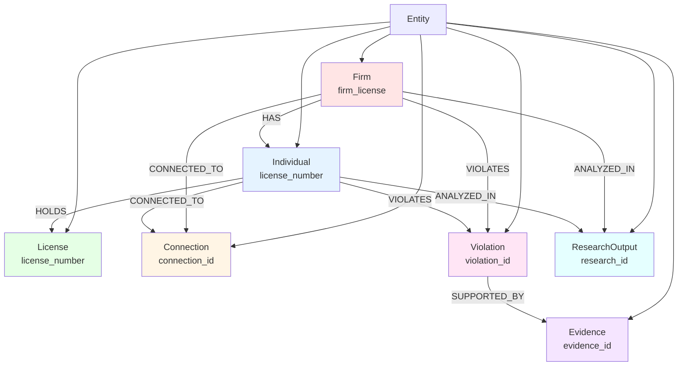
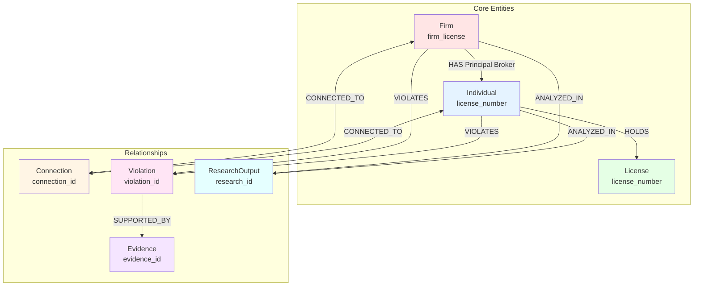

# Data Ontology

Conceptual model defining core entities, relationships, and properties in the Kettler Data Analysis domain.

## Overview

This ontology describes the semantic structure of the data, focusing on **what** entities exist, **how** they relate to each other, and **what properties** they possess.

> 📘 Complements [Data Dictionary](./DATA_DICTIONARY.md) (technical field definitions) and [Schema](./schema.json) (FK/PK relationships).

## Core Concepts

### Entity Types

<b>1. Firm</b> (`Firm`)

A licensed real estate firm entity.

**Properties:**
- ✅ Unique license number (10-digit Virginia DPOR)
- ✅ Legal name
- ✅ Business address
- ✅ Principal broker (Individual)
- ✅ License dates (initial certification, expiration)
- ✅ State jurisdiction

**Key Characteristics:**
- Primary identifier: `firm_license`
- Can have multiple connections to other firms
- Can be associated with violations
- Can be analyzed in research outputs

<b>2. Individual</b> (`Individual`)

A person holding a real estate license.

**Properties:**
- ✅ Unique license number (10-digit)
- ✅ Name
- ✅ Address
- ✅ License type
- ✅ Regulatory board
- ✅ State jurisdiction
- ✅ License expiration date

**Key Characteristics:**
- Primary identifier: `license_number`
- Can be a principal broker for firms
- Can have multiple licenses (different states/types)
- Can be connected to firms
- Can be associated with violations

<b>3. License</b> (`License`)

A regulatory authorization to practice real estate.

**Properties:**
- ✅ License number
- ✅ Type (Firm or Individual)
- ✅ State jurisdiction
- ✅ Dates (certification, expiration)
- ✅ Regulatory board

**Key Characteristics:**
- Can be a Firm License or Individual License
- Has temporal validity (expiration dates)
- Subject to regulatory oversight

<b>4. Connection</b> (`Connection`)

A relationship between entities (firm-to-firm, firm-to-individual).

**Properties:**
- ✅ Connection type
- ✅ Connection details
- ✅ State context
- ✅ Verification status
- ✅ Analysis date

**Key Characteristics:**
- Represents various relationship types
- Can be verified or unverified
- Temporal (can change over time)

<b>5. Violation</b> (`Violation`)

A regulatory violation identified through analysis.

**Properties:**
- ✅ Violation type
- ✅ Severity level
- ✅ Description
- ✅ Evidence files
- ✅ Identified date
- ✅ State jurisdiction

**Key Characteristics:**
- Can be associated with firms or individuals
- Has severity classification (High, Medium, Low)
- Supported by evidence
- Temporal (identified at a specific date)

<b>6. Evidence</b> (`Evidence`)

A document or data source supporting research findings.

**Properties:**
- ✅ File path
- ✅ Evidence type
- ✅ Extracted data
- ✅ Extraction date
- ✅ Source description

**Key Characteristics:**
- Can support violations
- Can be various types (PDF, Excel, Email, etc.)
- Contains extracted entities and data
- Temporal (extracted at a specific date)

<b>7. Research Output</b> (`ResearchOutput`)

An analysis result or finding from research activities.

**Properties:**
- ✅ Category
- ✅ File path
- ✅ Analysis date
- ✅ Findings summary
- ✅ Status
- ✅ Metadata

**Key Characteristics:**
- Can reference firms or individuals
- Categorized by research type
- Has completion status
- Temporal (analyzed at a specific date)

## Relationships

### Primary Relationships

<b>Firm HAS Principal Broker</b> (`Firm` → `Individual`)

- **Type:** One-to-Many
- **Cardinality:** Firm (1) → Individual (0..1)
- **Properties:** Principal broker name stored on firm
- **FK:** `firms.individual_license` → `individual_licenses.license_number` (optional)

<b>Individual HOLDS License</b> (`Individual` → `License`)

- **Type:** One-to-Many
- **Cardinality:** Individual (1) → License (1..*)
- **Properties:** License number is primary identifier

<b>Firm CONNECTED_TO Firm</b> (`Firm` → `Firm`)

- **Type:** Many-to-Many (via Connection entity)
- **Cardinality:** Firm (1) → Connection (0..*) → Firm (1)
- **Properties:** Connection type, details, verification status

<b>Firm CONNECTED_TO Individual</b> (`Firm` → `Individual`)

- **Type:** Many-to-Many (via Connection entity)
- **Cardinality:** Firm (1) → Connection (0..*) → Individual (1)
- **Properties:** Connection type (e.g., "Principal Broker")

<b>Firm VIOLATES Regulation</b> (`Firm` → `Violation`)

- **Type:** One-to-Many
- **Cardinality:** Firm (1) → Violation (0..*)
- **Properties:** Violation type, severity, description

<b>Individual VIOLATES Regulation</b> (`Individual` → `Violation`)

- **Type:** One-to-Many
- **Cardinality:** Individual (1) → Violation (0..*)
- **Properties:** Violation type, severity, description

<b>Violation SUPPORTED_BY Evidence</b> (`Violation` → `Evidence`)

- **Type:** One-to-Many
- **Cardinality:** Violation (1) → Evidence (0..*)
- **Properties:** Evidence type, extracted data, source

<b>Firm ANALYZED_IN Research</b> (`Firm` → `ResearchOutput`)

- **Type:** One-to-Many
- **Cardinality:** Firm (1) → ResearchOutput (0..*)
- **Properties:** Research category, findings summary, analysis date

<b>Individual ANALYZED_IN Research</b> (`Individual` → `ResearchOutput`)

- **Type:** One-to-Many
- **Cardinality:** Individual (1) → ResearchOutput (0..*)
- **Properties:** Research category, findings summary, analysis date

## Concept Hierarchy

## Relationship Cardinalities

| From Entity | Relationship | To Entity | Cardinality | Notes |
|-------------|--------------|-----------|-------------|-------|
| Firm | HAS Principal Broker | Individual | 1:0..1 | One firm has one principal broker (optional FK) |
| Individual | HOLDS | License | 1:1..* | One individual can hold multiple licenses |
| Firm | CONNECTED_TO | Firm | 1:0..* | Via Connection entity (many-to-many) |
| Firm | CONNECTED_TO | Individual | 1:0..* | Via Connection entity (many-to-many) |
| Firm | VIOLATES | Violation | 1:0..* | One firm can have multiple violations |
| Individual | VIOLATES | Violation | 1:0..* | One individual can have multiple violations |
| Violation | SUPPORTED_BY | Evidence | 1:0..* | One violation can have multiple evidence files |
| Firm | ANALYZED_IN | ResearchOutput | 1:0..* | One firm can be analyzed in multiple research outputs |
| Individual | ANALYZED_IN | ResearchOutput | 1:0..* | One individual can be analyzed in multiple research outputs |

## Business Rules

<b>License Rules</b>

1. ✅ Every firm must have a principal broker
2. ✅ License numbers are unique within their type (Firm vs Individual)
3. ✅ Licenses have expiration dates; expired licenses may still be relevant for historical analysis

<b>Connection Rules</b>

1. ✅ Connections can be verified or unverified
2. ✅ Connections have specific types that define the relationship
3. ✅ Firm-to-firm connections are bidirectional

<b>Violation Rules</b>

1. ✅ Violations should be supported by evidence files
2. ✅ All violations have a severity classification
3. ✅ Violations must be associated with at least one firm or individual

<b>Research Rules</b>

1. ✅ All research outputs belong to a category
2. ✅ Research outputs have a completion status
3. ✅ Research outputs can reference firms or individuals (optional)

## Ontology Diagram

## Related Documentation

- 📋 [Data Dictionary](./DATA_DICTIONARY.md) - Technical field definitions
- 📊 [Schema Definition](./schema.json) - FK/PK relationships
- 🔗 [Data Ancestry](./ANCESTRY.md) - Data lineage and transformations
- 📁 [Repository Structure](../docs/REPOSITORY_STRUCTURE.md) - File organization
