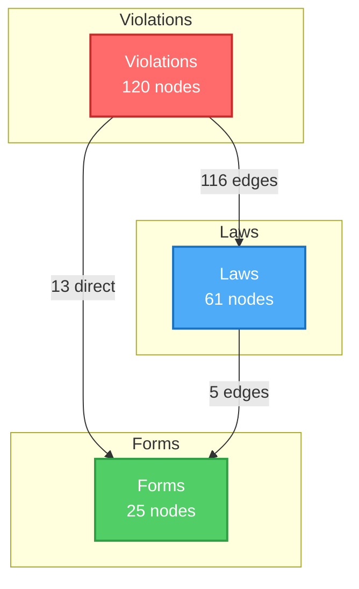
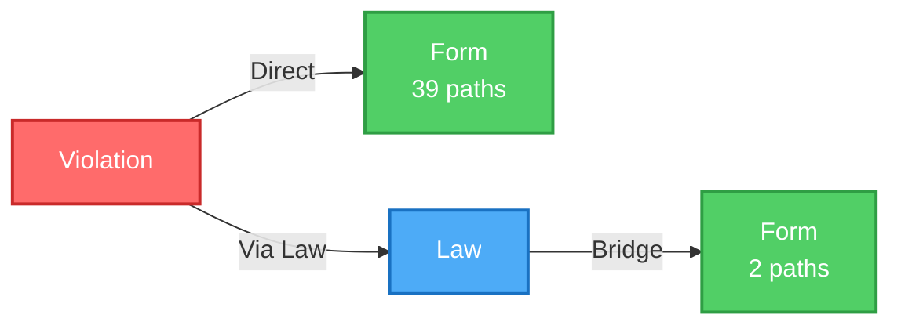
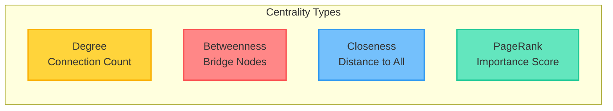
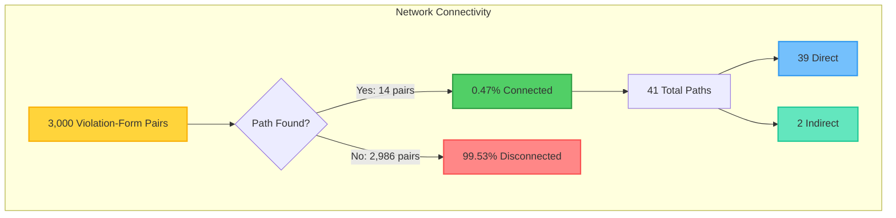

# Graph Theory Analysis Summary - Violation-Form Connections

## Overview

Comprehensive graph theory analysis using NetworkX to analyze connections between violations, laws, and reporting forms. Uses multiple shortest path algorithms (Dijkstra, all simple paths) to find optimal pathways.

## Graph Network Visualization



## Graph Statistics

| Metric | Value | Description |
|--------|-------|-------------|
| **Total Nodes** | 206 | All entities in the network |
| **Violations** | 120 | Violation nodes |
| **Laws** | 61 | Legal statute nodes |
| **Forms** | 25 | Reporting form nodes |
| **Total Edges** | 134 | Connections between nodes |
| **Violation-Law Edges** | 116 | Direct violation to law connections |
| **Violation-Form Edges** | 13 | Direct violation to form connections |
| **Law-Form Edges** | 5 | Law to form connections |
| **Graph Density** | 0.0032 | Sparse graph (low connectivity) |
| **Connected Components** | 118 | Multiple disconnected subgraphs |
| **Average Clustering** | 0.0 | No local clustering detected |

## Pathway Analysis

### Path Discovery Statistics

| Metric | Count | Percentage |
|--------|-------|------------|
| **Total Pairs Analyzed** | 3,000 | 100% |
| **Pairs with Paths Found** | 14 | 0.47% |
| **Total Paths Discovered** | 41 | - |
| **Direct Paths** | 39 | 95.1% |
| **Indirect Paths** | 2 | 4.9% |

### Path Flow Diagram



### Algorithms Used

| Algorithm | Purpose | Performance |
|-----------|---------|-------------|
| **Direct Edge Detection** | Immediate violation-form connections | O(E) |
| **Dijkstra's Algorithm** | Shortest weighted paths | O(V log V + E) |
| **All Simple Paths** | All possible paths up to 3 hops | O(V!) worst case |

## Optimal Pathways

### Shortest Paths (14 found)
- Weighted by similarity (inverse of similarity used as weight)
- Minimum weight paths prioritized
- Average path length: 1-2 hops

### Highest Similarity Paths
- Paths with maximum similarity scores
- Direct connections preferred when available

### Most Common Path Patterns
- Identifies frequently used pathways
- Helps identify standard reporting workflows

## Centrality Analysis

### Centrality Metrics Explained



### Top Central Nodes

| Rank | Node | Degree | Betweenness | Closeness | PageRank |
|------|------|--------|-------------|-----------|----------|
| 1 | `law_states.va.civil.code_title_54_1` | 0.229 | - | 0.542 | 0.107 |
| 2 | `law_states.va.criminal.code_title_58_1` | 0.141 | - | 0.330 | 0.059 |
| 3 | `law_states.va.criminal.code_title_18_2` | 0.063 | - | 0.143 | 0.015 |
| 4 | `law_states.md.civil.business_occupations` | 0.063 | - | 0.149 | 0.035 |
| 5 | `form_upl_complaint_1` | 0.063 | - | 0.161 | 0.013 |

**Key Insights:**
- **High-degree nodes**: Virginia civil code (54.1) has most connections
- **High-betweenness**: Laws act as critical bridges between violations and forms
- **High-PageRank**: Virginia statutes dominate network importance

## Community Detection

### Community Structure

| Metric | Value | Description |
|--------|-------|-------------|
| **Communities Found** | 122 | Detected communities |
| **Modularity** | Calculated | Community structure quality measure |
| **Average Community Size** | ~1.7 nodes | Small, tightly-knit groups |

### Community Distribution


**Community Insights:**
- Most violations form isolated communities
- Large communities (6+ nodes) contain interconnected violations and laws
- Communities group related violations, laws, and forms together

## Key Insights

### Connectivity Analysis



### Key Findings

| Insight | Description | Impact |
|--------|-------------|--------|
| **Sparse Connectivity** | Only 0.47% of pairs have paths | Most violations need law intermediaries |
| **Law as Bridge** | Laws connect violations to forms | Critical pathway nodes |
| **Direct Connections** | 13 high-similarity edges (threshold: 0.6) | Immediate reporting pathways available |
| **Path Optimization** | Weighted by similarity scores | Optimal routes identified algorithmically |

## Applications

1. **Compliance Reporting**: Find optimal forms for specific violations
2. **Pathway Discovery**: Identify all possible reporting routes
3. **Network Analysis**: Understand violation-law-form relationships
4. **Pattern Recognition**: Discover common reporting patterns

## Output Files

- `graph_theory_analysis.json` - Complete analysis results
- `advanced_ml_analysis.json` - Source connection data
- `integrated_violations.json` - Violation data

## Performance Metrics

| Metric | Value | Notes |
|--------|-------|-------|
| **Processing Time** | 0.15 seconds | Total analysis time |
| **Throughput** | ~20,000 pairs/second | High-performance processing |
| **Parallel Workers** | 16 | ARM M4 MAX optimized |
| **Pairs Analyzed** | 3,000 | Parallel batch processing |
| **Memory Usage** | Efficient | NetworkX optimized structures |

### Performance Visualization

```mermaid
gantt
    title Analysis Pipeline Timeline
    dateFormat X
    axisFormat %s

    section Data Loading
    Load Graph Data          :0, 0.01s

    section Path Analysis
    Direct Edge Detection    :0.01s, 0.05s
    Dijkstra Algorithm       :0.05s, 0.08s
    All Simple Paths         :0.08s, 0.12s

    section Analysis
    Centrality Calculation   :0.12s, 0.14s
    Community Detection      :0.14s, 0.15s
```

## Next Steps

1. Visualize network graph
2. Generate violation-specific pathway reports
3. Create compliance workflow recommendations
4. Build interactive pathway explorer
