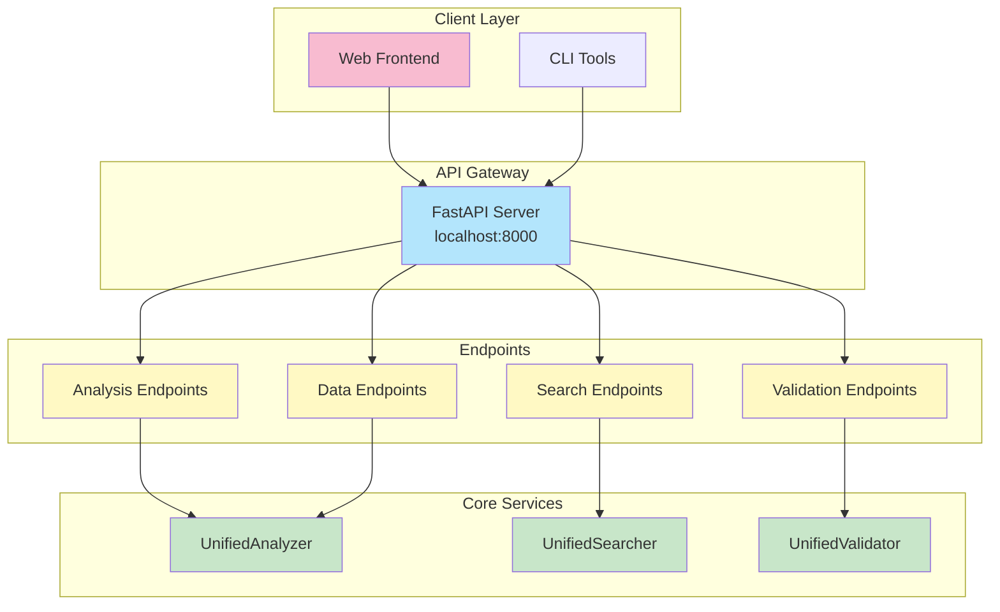
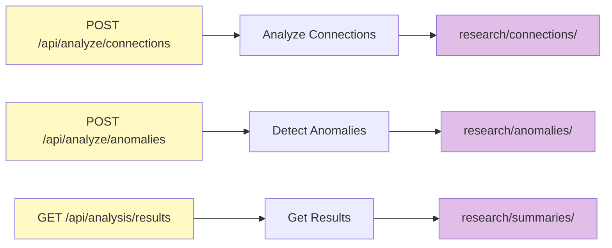
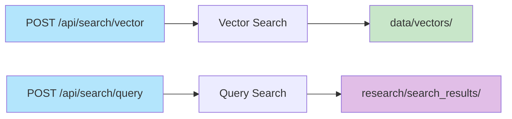
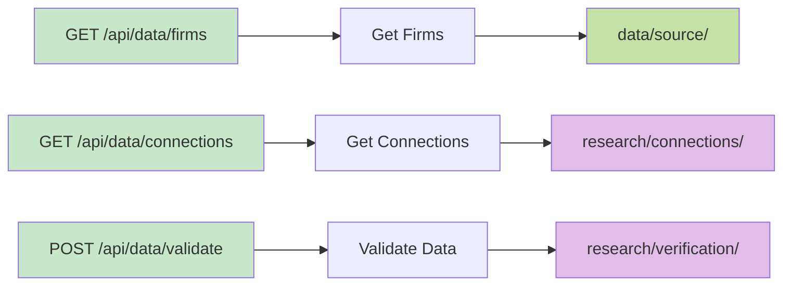

# API Reference

## API Architecture

## Endpoints

**Base URL:** `http://localhost:8000`

### Analysis Endpoints

- `POST /api/analyze/connections` - Analyze connections
- `POST /api/analyze/anomalies` - Detect anomalies
- `GET /api/analysis/results` - Get analysis results

### Search Endpoints

- `POST /api/search/vector` - Vector search
- `POST /api/search/query` - Query search

### Data Endpoints

- `GET /api/data/firms` - Get firms
- `GET /api/data/connections` - Get connections
- `POST /api/data/validate` - Validate data

## API Documentation

**Interactive Docs:** `http://localhost:8000/docs`

Swagger UI provides interactive API documentation with:
- Endpoint descriptions
- Request/response schemas
- Try-it-out functionality
- Authentication options
