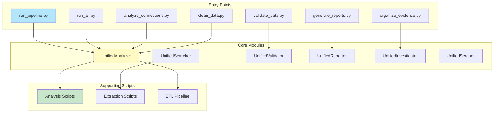
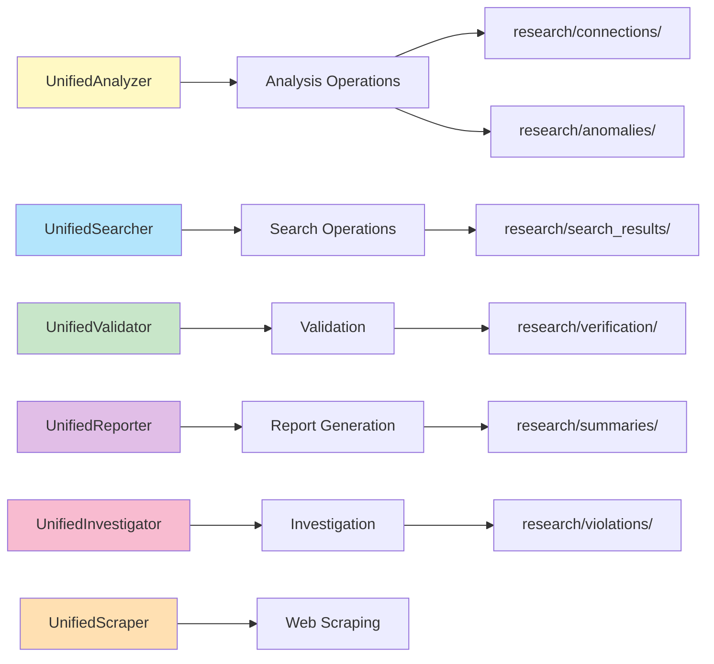
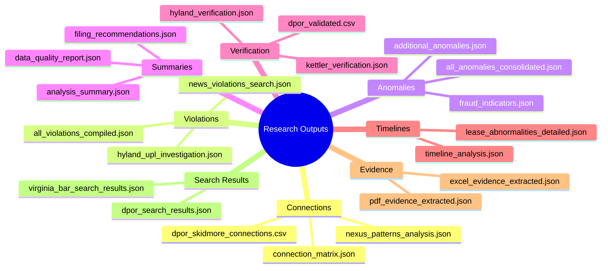

# System Components

## Component Hierarchy

## Entry Points (`bin/`)

- `run_pipeline.py` - Full pipeline
- `run_all.py` - All analyses
- `analyze_connections.py` - Connections
- `validate_data.py` - Validation
- `generate_reports.py` - Reports
- `organize_evidence.py` - Evidence
- `clean_data.py` - Data cleaning

## Core Modules (`scripts/core/`)

- `unified_analysis.py` - UnifiedAnalyzer
- `unified_search.py` - UnifiedSearcher
- `unified_validation.py` - UnifiedValidator
- `unified_reporting.py` - UnifiedReporter
- `unified_investigation.py` - UnifiedInvestigator
- `unified_scraping.py` - UnifiedScraper

## Analysis (`scripts/analysis/`)

- `analyze_fraud_patterns.py` - Fraud detection
- `analyze_str_listings.py` - STR analysis

## Extraction (`scripts/extraction/`)

- `extract_pdf_evidence.py` - PDF extraction
- `extract_excel_evidence.py` - Excel extraction
- `extract_all_evidence.py` - Master extraction

## ETL (`scripts/etl/`)

- `etl_pipeline.py` - Main pipeline
- `vector_embeddings.py` - Vector generation
- `vector_api_server.py` - Vector API

## API (`api/`)

- `server.py` - FastAPI server
- Endpoints for all operations

## Web (`web/`)

- React/TypeScript frontend
- Components for analysis, search, visualization

## Microservices (`microservices/`)

- `api-gateway/` - Request routing
- `analysis-service/` - Analysis processing
- `vector-service/` - Vector operations
- `validation-service/` - Validation
- `scraping-service/` - Web scraping
- `gis-service/` - GIS operations
- `acris-service/` - ACRIS operations
- `data-service/` - Data operations

## Data (`data/`)

- `source/` - Source data
- `raw/` - Raw results
- `cleaned/` - Cleaned data
- `analysis/` - Analysis outputs
- `vectors/` - Vector embeddings

## Research (`research/`)

- `connections/` - Connection analyses
- `violations/` - Violation findings
- `anomalies/` - Anomaly reports
- `evidence/` - Evidence summaries
- `verification/` - Verification results
- `timelines/` - Timeline analyses

## Configuration (`config/`)

- `state_dpor_registry.csv` - State registry
- `templates/` - Config templates
