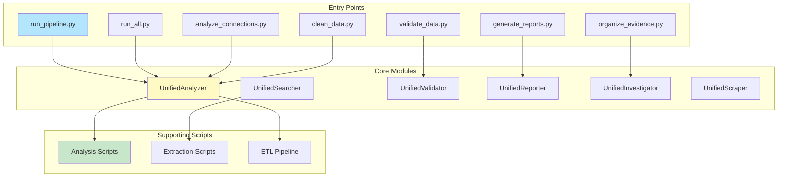
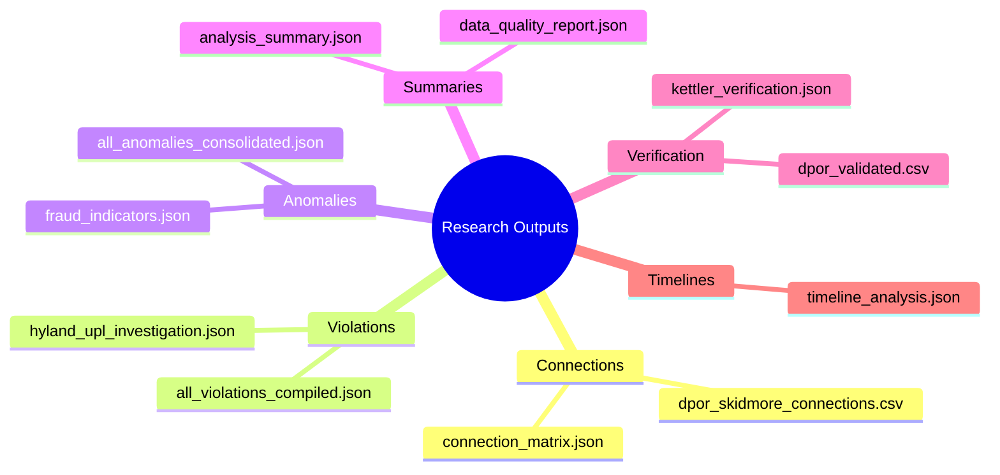

# System Components


## Component Hierarchy



## Entry Points (`bin/`)

| Script | Purpose | Output |
|--------|---------|--------|
| `run_pipeline.py` | Full pipeline | All outputs |
| `run_all.py` | All analyses | Research outputs |
| `analyze_connections.py` | Connections | `research/connections/` |
| `validate_data.py` | Validation | `research/verification/` |
| `generate_reports.py` | Reports | `research/summaries/` |
| `organize_evidence.py` | Evidence | `research/evidence/` |
| `clean_data.py` | Cleaning | `data/cleaned/` |

## Core Modules (`scripts/core/`)

<details>
<summary><b>UnifiedAnalyzer</b> (`unified_analysis.py`)</summary>

**Purpose:** Analysis operations

**Features:**
- ✅ Connection analysis
- ✅ Pattern detection
- ✅ Anomaly identification
- ✅ Fraud analysis

**Output:** `research/connections/`, `research/anomalies/`

</details>

<details>
<summary><b>UnifiedSearcher</b> (`unified_search.py`)</summary>

**Purpose:** Search operations

**Features:**
- ✅ Multi-state license searches
- ✅ Database queries
- ✅ Web scraping

**Output:** `research/search_results/`

</details>

<details>
<summary><b>UnifiedValidator</b> (`unified_validation.py`)</summary>

**Purpose:** Data validation

**Features:**
- ✅ Schema validation
- ✅ FK/PK integrity checks
- ✅ Data quality reports

**Output:** `research/verification/`

</details>

<details>
<summary><b>UnifiedReporter</b> (`unified_reporting.py`)</summary>

**Purpose:** Report generation

**Features:**
- ✅ Summary reports
- ✅ Quality reports
- ✅ Analysis summaries

**Output:** `research/summaries/`

</details>

<details>
<summary><b>UnifiedInvestigator</b> (`unified_investigation.py`)</summary>

**Purpose:** Investigation operations

**Features:**
- ✅ Violation detection
- ✅ Timeline analysis
- ✅ Evidence compilation

**Output:** `research/violations/`, `research/timelines/`

</details>

<details>
<summary><b>UnifiedScraper</b> (`unified_scraping.py`)</summary>

**Purpose:** Web scraping

**Features:**
- ✅ Automated searches
- ✅ CAPTCHA handling
- ✅ Data extraction

**Output:** `data/scraped/`

</details>

## Supporting Scripts

<details>
<summary><b>Analysis</b> (`scripts/analysis/`)</summary>

- `analyze_fraud_patterns.py` - Fraud detection
- `analyze_str_listings.py` - STR analysis

</details>

<details>
<summary><b>Extraction</b> (`scripts/extraction/`)</summary>

- `extract_pdf_evidence.py` - PDF extraction
- `extract_excel_evidence.py` - Excel extraction
- `extract_all_evidence.py` - Master extraction

</details>

<details>
<summary><b>ETL</b> (`scripts/etl/`)</summary>

- `etl_pipeline.py` - Main pipeline
- `vector_embeddings.py` - Vector generation
- `vector_api_server.py` - Vector API

</details>

## Research Outputs



## Usage Example

```python
from scripts.core import UnifiedAnalyzer

analyzer = UnifiedAnalyzer()
analyzer.load_all_data()
results = analyzer.analyze_all()
```

> 📘 See [SYSTEM_ARCHITECTURE.md](SYSTEM_ARCHITECTURE.md) for architecture details.
