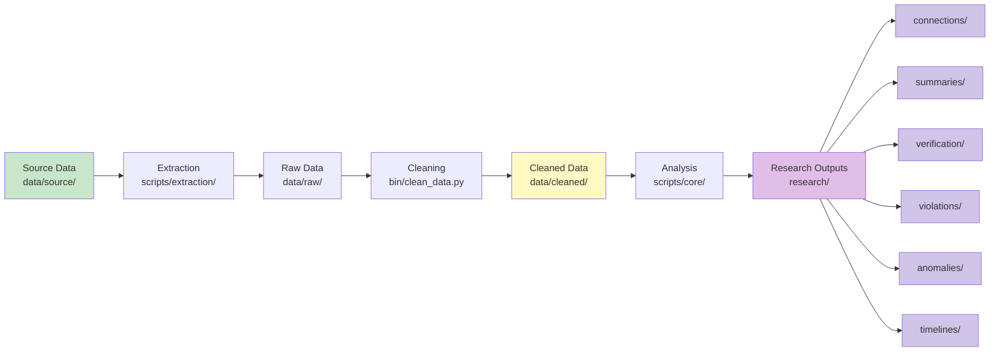

# Data Flow


## Pipeline Overview



## Processing Steps

<details>
<summary><b>1. Source Data</b> (`data/source/`)</summary>

**Files:**
- `skidmore_all_firms_complete.json` - 38 firms
- `skidmore_individual_licenses.json` - Individual licenses

**Format:** JSON
**Status:** ✅ Complete

</details>

<details>
<summary><b>2. Extraction</b> (`scripts/extraction/`)</summary>

**Purpose:** Extract data from PDFs, Excel files, web sources

**Scripts:**
- `extract_pdf_evidence.py` - PDF extraction
- `extract_excel_evidence.py` - Excel extraction

**Output:** `data/raw/`

</details>

<details>
<summary><b>3. Raw Data</b> (`data/raw/`)</summary>

**Content:** Unprocessed search results

**Status:** Gitignored (not tracked)

</details>

<details>
<summary><b>4. Cleaning</b> (`bin/clean_data.py`)</summary>

**Purpose:** Standardize and normalize data

**Operations:**
- ✅ Normalize firm names
- ✅ Standardize addresses
- ✅ Parse dates
- ✅ Extract entities
- ✅ Remove duplicates

**Output:** `data/cleaned/`

</details>

<details>
<summary><b>5. Cleaned Data</b> (`data/cleaned/`)</summary>

**Files:**
- `firms.json` - Cleaned firm data
- `individual_licenses.json` - Cleaned license data

**Status:** Gitignored (not tracked)

</details>

<details>
<summary><b>6. Analysis</b> (`scripts/core/`, `scripts/analysis/`)</summary>

**Purpose:** Run analyses and generate insights

**Modules:**
- UnifiedAnalyzer - Analysis operations
- UnifiedInvestigator - Investigation
- Analysis scripts - Pattern detection

**Output:** `research/{category}/`

</details>

<details>
<summary><b>7. Research Outputs</b> (`research/`)</summary>

**Categories:**
- `connections/` - Connection analyses
- `violations/` - Violation findings
- `anomalies/` - Anomaly reports
- `evidence/` - Evidence summaries
- `verification/` - Verification results
- `summaries/` - Summary reports
- `timelines/` - Timeline analyses

**Status:** ✅ 350+ files

</details>

## Data Types

| Type | Location | Description |
|------|----------|-------------|
| **Source** | `data/source/` | Authoritative datasets |
| **Raw** | `data/raw/` | Unprocessed results |
| **Cleaned** | `data/cleaned/` | Standardized data |
| **Vectors** | `data/vectors/` | Vector embeddings |
| **Research** | `research/` | Analysis outputs |

## Quick Reference

```bash
# Run full pipeline
python bin/run_pipeline.py

# Run individual steps
python bin/clean_data.py           # Step 4: Cleaning
python bin/analyze_connections.py  # Step 6: Analysis
python bin/validate_data.py        # Validation
```

> 📘 See [SYSTEM_ARCHITECTURE.md](SYSTEM_ARCHITECTURE.md) for architecture details.
