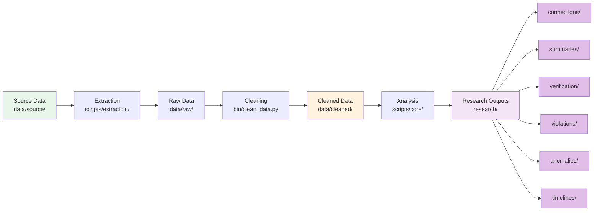

# Data Flow

## Pipeline



## Text Pipeline

```
1. Source Data (data/source/)
   ↓
2. Extraction (scripts/extraction/)
   ↓
3. Raw Data (data/raw/)
   ↓
4. Cleaning (bin/clean_data.py)
   ↓
5. Cleaned Data (data/cleaned/)
   ↓
6. Analysis (scripts/core/, scripts/analysis/)
   ↓
7. Research Outputs (research/{category}/)
```

## Data Types

**Source:**
- `data/source/skidmore_all_firms_complete.json` - 38 firms
- `data/source/skidmore_individual_licenses.json` - Individual licenses

**Raw:**
- `data/raw/` - Search results (gitignored)

**Cleaned:**
- `data/cleaned/` - Standardized data (gitignored)

**Research:**
- `research/connections/dpor_skidmore_connections.csv` - Connections
- `research/verification/dpor_validated.csv` - Validated data
- `research/summaries/analysis_summary.json` - Summary

**Research:**
- `research/connections/` - Connection analyses
- `research/violations/` - Violation findings
- `research/anomalies/` - Anomaly reports
- `research/evidence/` - Evidence summaries

## Processing Steps

1. **Load** - Read source data
2. **Extract** - Extract from PDFs/Excel
3. **Transform** - Clean and standardize
4. **Analyze** - Run analyses
5. **Store** - Save to research outputs
