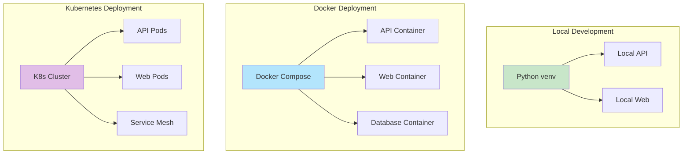
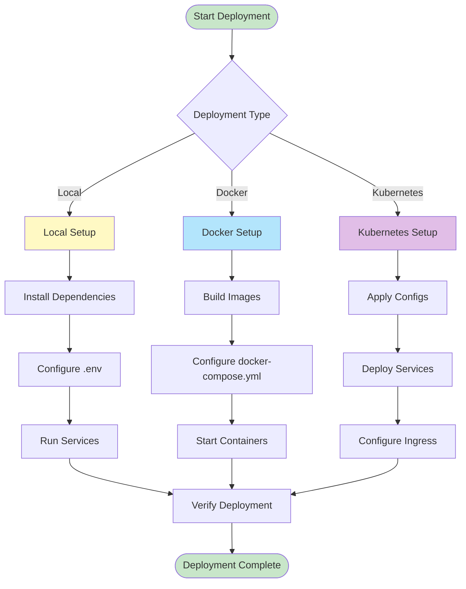
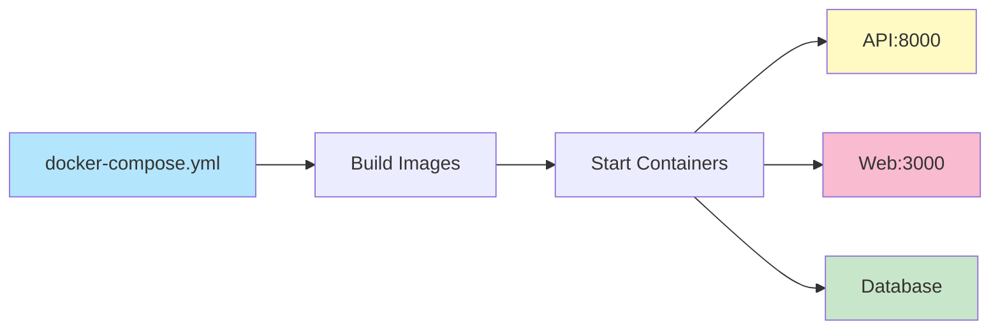
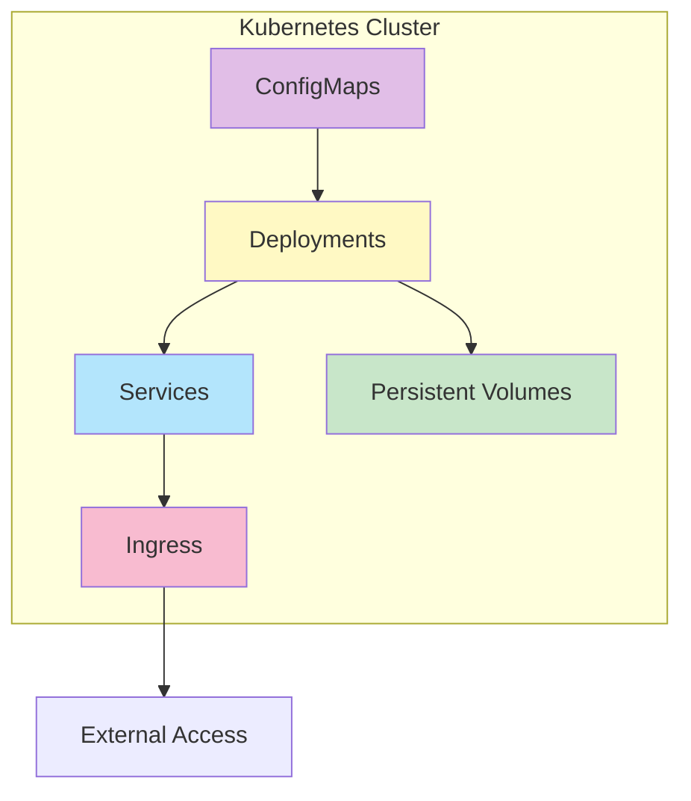
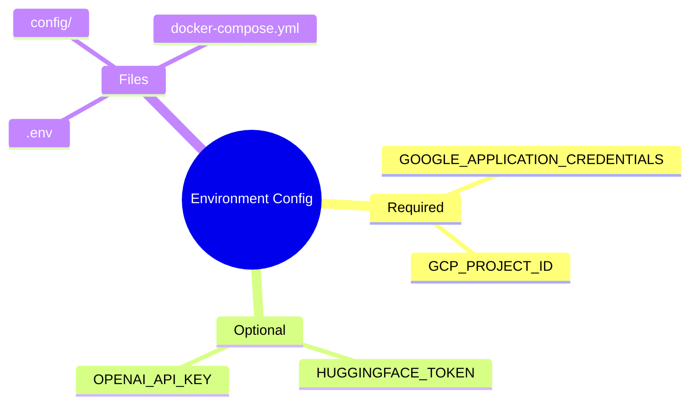
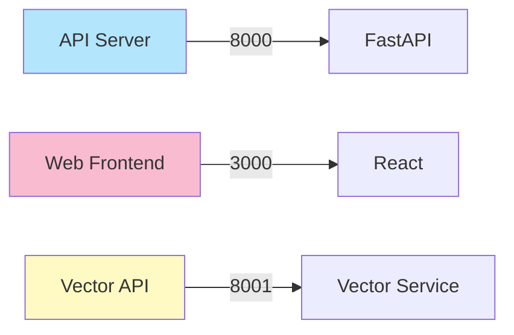

# Deployment Guide

## Deployment Architecture



## Deployment Flow



## Local Deployment

```bash

# API
cd api && python server.py

# Web
cd web && npm run dev

# Pipeline
python bin/run_pipeline.py
```

## Docker Deployment



```bash
make build
make up
make logs
```

## Kubernetes Deployment



```bash
kubectl apply -f kubernetes/
```

## Environment Configuration



- `.env` - Environment variables
- `config/` - Configuration files
- `docker-compose.yml` - Docker setup

## Service Ports



- **API:** `http://localhost:8000`
- **Web:** `http://localhost:3000`
- **Vector API:** `http://localhost:8001` (if running)
