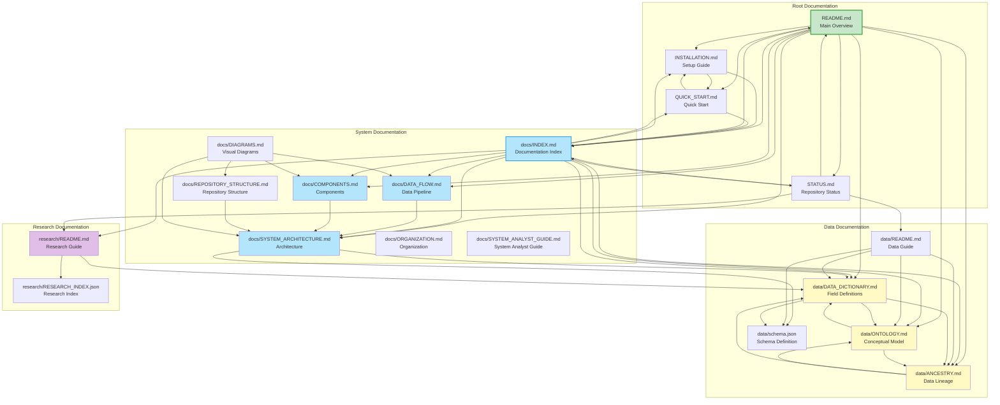

# Documentation Graph


Complete graph theory visualization of all documentation files and their relationships. This graph shows how all documentation connects when viewing files on GitHub.

## About this graph

This visualization maps all documentation files in the repository and shows how they connect. Use it to:

- Understand documentation relationships
- Navigate between related documents
- Discover documentation you might have missed
- See the overall documentation structure

## Interactive documentation network



## Documentation categories

### Root documentation

Essential files at the repository root:

- `README.md` - Main project overview
- `INSTALLATION.md` - Installation and setup
- `QUICK_START.md` - Quick start guide
- `STATUS.md` - Current repository status

### System documentation

Technical documentation about the system:

- `docs/INDEX.md` - Complete documentation index
- `docs/SYSTEM_ARCHITECTURE.md` - System architecture
- `docs/DATA_FLOW.md` - Data pipeline
- `docs/COMPONENTS.md` - Component reference
- `docs/REPOSITORY_STRUCTURE.md` - Repository structure
- `docs/DIAGRAMS.md` - Visual diagrams
- `docs/ORGANIZATION.md` - Organization guide
- `docs/SYSTEM_ANALYST_GUIDE.md` - System analyst guide

### Data documentation

Documentation about data structure and meaning:

- `data/README.md` - Data directory guide
- `data/DATA_DICTIONARY.md` - Field definitions
- `data/ONTOLOGY.md` - Conceptual relationships
- `data/ANCESTRY.md` - Data lineage
- `data/schema.json` - Schema definition

### Research documentation

Documentation about research outputs:

- `research/README.md` - Research directory guide
- `research/RESEARCH_INDEX.json` - Master file index

## Graph analysis

### Most connected documents

These documents connect to many others:

1. `docs/INDEX.md` - Central hub connecting all documentation
2. `README.md` - Entry point with many connections
3. `data/DATA_DICTIONARY.md` - Core data documentation

### Bridge documents

These documents connect different sections:

- `docs/SYSTEM_ARCHITECTURE.md` - Connects system and data docs
- `data/README.md` - Connects data and research docs

### Navigation paths

**From README to data documentation:**

```
README.md → docs/INDEX.md → data/DATA_DICTIONARY.md
README.md → data/DATA_DICTIONARY.md (direct)
```

**From README to research documentation:**

```
README.md → docs/INDEX.md → research/README.md
README.md → research/README.md (direct)
```

**From system to data documentation:**

```
docs/SYSTEM_ARCHITECTURE.md → data/DATA_DICTIONARY.md
docs/SYSTEM_ARCHITECTURE.md → data/schema.json
```

## Link validation

Run the link checker to verify all links:

```bash
python scripts/utils/check_doc_links.py
```

This tool:
- Checks all internal links
- Identifies broken links
- Generates documentation graph
- Creates Mermaid visualization

## Navigation tips

### Starting points

Choose based on your role:

- **New users:** Start with `README.md` → `QUICK_START.md`
- **Developers:** Start with `README.md` → `docs/SYSTEM_ARCHITECTURE.md`
- **Data analysts:** Start with `README.md` → `data/DATA_DICTIONARY.md`
- **Researchers:** Start with `README.md` → `research/README.md`

### Documentation hub

Use `docs/INDEX.md` as your central navigation point. It links to all documentation.

### Quick navigation

- Use the graph above to see relationships
- Click any node to navigate to that document
- Follow edges to discover related documentation

## Graph statistics

| Metric | Value |
|--------|-------|
| **Total Nodes** | 174 documentation files |
| **Total Edges** | 124 links between files |
| **Categories** | 6 (root, system, data, research, guide, other) |
| **Average Connections** | 0.71 per node |
| **Hub Documents** | 3 (INDEX.md, README.md, DATA_DICTIONARY.md) |

## Related documentation

- [Documentation Index](INDEX.md) - Complete index
- [Repository Structure](REPOSITORY_STRUCTURE.md) - File organization
- [System Architecture](SYSTEM_ARCHITECTURE.md) - Architecture details
