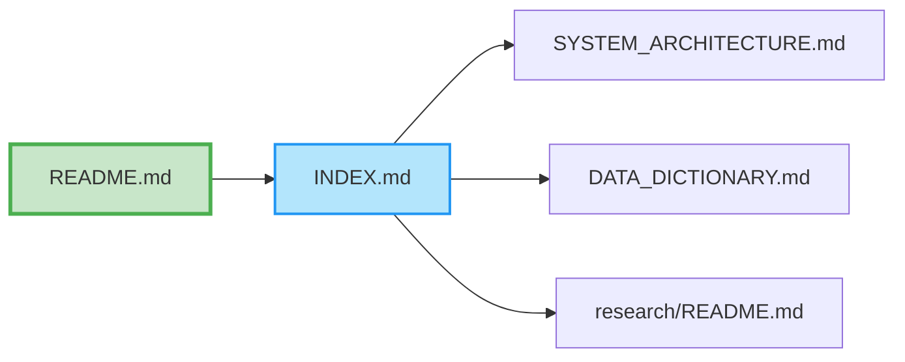

# Documentation Index

Complete index of all documentation in the repository.

## 📑 Documentation Graph

**Start here to see how all documentation connects:**

> 📊 See [DOCUMENTATION_GRAPH.md](DOCUMENTATION_GRAPH.md) for complete interactive graph with 173 nodes and 110 edges.

## Getting Started

- [README.md](../README.md) - Main overview
- [INSTALLATION.md](../INSTALLATION.md) - Installation and setup
- [QUICK_START.md](../QUICK_START.md) - Quick start guide
- [STATUS.md](../STATUS.md) - Current repository status

## System Documentation

- [SYSTEM_ARCHITECTURE.md](SYSTEM_ARCHITECTURE.md) - System architecture
- [DATA_FLOW.md](DATA_FLOW.md) - Data pipeline
- [COMPONENTS.md](COMPONENTS.md) - Component reference
- [REPOSITORY_STRUCTURE.md](REPOSITORY_STRUCTURE.md) - Repository structure
- [SYSTEM_ANALYST_GUIDE.md](SYSTEM_ANALYST_GUIDE.md) - System analyst guide
- [ORGANIZATION.md](ORGANIZATION.md) - Repository organization
- [DIAGRAMS.md](DIAGRAMS.md) - Visual diagrams

## Data Documentation

- [data/schema.json](../data/schema.json) - Complete schema with FK/PK
- [data/DATA_DICTIONARY.md](../data/DATA_DICTIONARY.md) - Field definitions
- [data/ONTOLOGY.md](../data/ONTOLOGY.md) - Conceptual relationships
- [data/ANCESTRY.md](../data/ANCESTRY.md) - Data lineage
- [data/metadata.json](../data/metadata.json) - Global metadata
- [data/README.md](../data/README.md) - Data directory guide

## Research Documentation

- [research/README.md](../research/README.md) - Research directory guide
- [research/RESEARCH_INDEX.json](../research/RESEARCH_INDEX.json) - Master file index

## API & Deployment

- [DEPLOYMENT.md](DEPLOYMENT.md) - Deployment guide

## Documentation Graph

- [DOCUMENTATION_GRAPH.md](DOCUMENTATION_GRAPH.md) - Complete documentation network graph (graph theory visualization)
