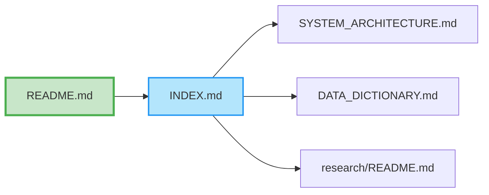

# Documentation Index

Complete index of all documentation in the repository.

## About this index

This index helps you find documentation quickly. Use it to:

- Discover available documentation
- Navigate to specific topics
- Understand documentation structure
- Find related documents

## Documentation graph

See how all documentation connects:

> See [DOCUMENTATION_GRAPH.md](DOCUMENTATION_GRAPH.md) for complete interactive graph with 174 nodes and 124 edges.

## Getting started

Essential documentation for new users:

- [README.md](../README.md) - Main overview
- [INSTALLATION.md](../INSTALLATION.md) - Installation and setup
- [QUICK_START.md](../QUICK_START.md) - Quick start guide
- [STATUS.md](../STATUS.md) - Current repository status

## System documentation

Technical documentation about the system:

- [SYSTEM_ARCHITECTURE.md](SYSTEM_ARCHITECTURE.md) - Complete system architecture (components, data flow, structure, diagrams)
- [REPOSITORY_STRUCTURE.md](REPOSITORY_STRUCTURE.md) - Detailed repository structure
- [SYSTEM_ANALYST_GUIDE.md](SYSTEM_ANALYST_GUIDE.md) - System analyst guide
- [DEPLOYMENT.md](DEPLOYMENT.md) - Deployment guide
- [ARCHIVE.md](ARCHIVE.md) - Historical archive (consolidated status files)
- [NAMING_CONVENTIONS.md](NAMING_CONVENTIONS.md) - File naming conventions and standards
- [DOCUMENTATION_ARCHITECTURE_VERIFICATION.md](DOCUMENTATION_ARCHITECTURE_VERIFICATION.md) - Comprehensive verification of documentation-to-code/data alignment

## Data documentation

Documentation about data structure, governance, and management:

### Data structure
- [data/schema.json](../data/schema.json) - Complete schema with FK/PK
- [data/DATA_DICTIONARY.md](../data/DATA_DICTIONARY.md) - Field definitions
- [data/ONTOLOGY.md](../data/ONTOLOGY.md) - Conceptual relationships
- [data/ANCESTRY.md](../data/ANCESTRY.md) - Data lineage
- [data/metadata.json](../data/metadata.json) - Global metadata

### Data governance and cataloging
- [data/DATA_CATALOG.md](../data/DATA_CATALOG.md) - Comprehensive data catalog (discoverability, metadata, quality)
- [data/GOVERNANCE.md](../data/GOVERNANCE.md) - Data governance framework (policies, compliance, security)

### Data directory
- [data/README.md](../data/README.md) - Data directory guide

## Research documentation

Documentation about research outputs:

- [research/README.md](../research/README.md) - Research directory guide
- [research/research_index.json](../research/research_index.json) - Master file index

## Analysis & Visualization

Documentation about analysis capabilities and visualizations:

- [scripts/analysis/IMPLEMENTATION_SUMMARY.md](../scripts/analysis/IMPLEMENTATION_SUMMARY.md) - ML implementation details
- [scripts/analysis/utils/advanced_visualizations.py](../scripts/analysis/utils/advanced_visualizations.py) - Visualization utilities
- [data/processed/GRAPH_THEORY_ANALYSIS_SUMMARY.md](../data/processed/GRAPH_THEORY_ANALYSIS_SUMMARY.md) - Graph theory analysis
- [data/processed/DATA_CLEANING_SUMMARY.md](../data/processed/DATA_CLEANING_SUMMARY.md) - Data cleaning summary
- [data/processed/SDLC_PIPELINE_SUMMARY.md](../data/processed/SDLC_PIPELINE_SUMMARY.md) - SDLC pipeline summary
- [data/processed/OPTIMIZATION_SUMMARY.md](../data/processed/OPTIMIZATION_SUMMARY.md) - Performance optimization

### Visualization Capabilities
- **Plotly**: Interactive web visualizations (15+ chart types)
- **Bokeh**: Browser-based interactive charts
- **Altair**: Declarative statistical visualizations
- **Seaborn**: Statistical data visualization
- **Dash**: Interactive web dashboards
- **NetworkX**: Graph visualization

## API & deployment

- [DEPLOYMENT.md](DEPLOYMENT.md) - Deployment guide

## Documentation graph

- [DOCUMENTATION_GRAPH.md](DOCUMENTATION_GRAPH.md) - Complete documentation network graph (graph theory visualization)
