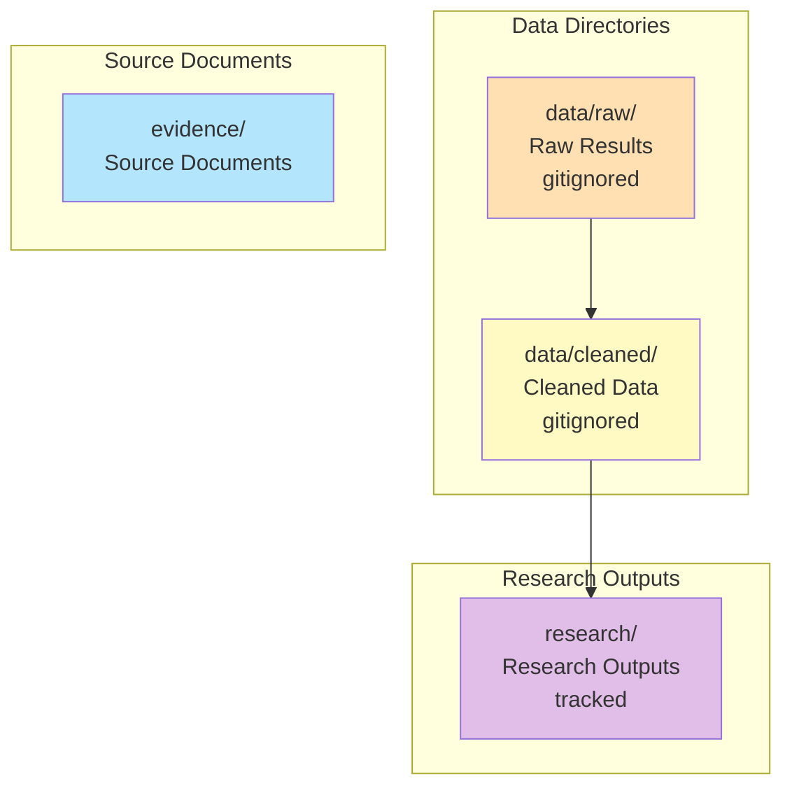
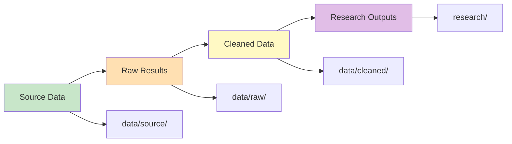

# Maintenance

## Maintenance Structure



**Text Structure:**

```
data/raw/         # Raw results (gitignored)
data/cleaned/     # Cleaned data (gitignored)
research/         # Research outputs (tracked)
evidence/         # Source documents
```

## Scripts

- `bin/` - Entry points
- `scripts/core/` - Unified modules
- `scripts/analysis/` - Analysis scripts
- `scripts/extraction/` - Evidence extraction

## Paths

Use `scripts/utils/paths.py` for all file paths.

## Data Flow



**Text Flow:**

1. Source data → `data/source/`
2. Raw results → `data/raw/`
3. Cleaned data → `data/cleaned/`
4. Research outputs → `research/{category}/`
