# Organization

## Structure

```mermaid
graph TB
    ROOT[Repository Root] --> BIN[bin/<br/>Entry Points]
    ROOT --> SCRIPTS[scripts/<br/>Library Code]
    ROOT --> DATA[data/<br/>Data Directories]
    ROOT --> RESEARCH[research/<br/>Research Outputs]
    ROOT --> CONFIG[config/<br/>Configuration]

    SCRIPTS --> CORE[core/<br/>Unified Modules]
    SCRIPTS --> ANALYSIS[analysis/<br/>Analysis]
    SCRIPTS --> EXTRACTION[extraction/<br/>Evidence Extraction]
    SCRIPTS --> ETL[etl/<br/>ETL/Vectorization]

    DATA --> SOURCE[source/<br/>Source Data]
    DATA --> RAW[raw/<br/>Raw Data]
    DATA --> CLEANED[cleaned/<br/>Cleaned Data]
    DATA --> VECTORS[vectors/<br/>Vector Embeddings]

    RESEARCH --> CONNECTIONS[connections/<br/>Connection Analyses]
    RESEARCH --> VIOLATIONS[violations/<br/>Violation Findings]
    RESEARCH --> ANOMALIES[anomalies/<br/>Anomaly Reports]
    RESEARCH --> EVIDENCE[evidence/<br/>Evidence Summaries]
    RESEARCH --> VERIFICATION[verification/<br/>Verification Results]
    RESEARCH --> TIMELINES[timelines/<br/>Timeline Analyses]

    style ROOT fill:#e3f2fd
    style DATA fill:#e8f5e9
    style RESEARCH fill:#f3e5f5
    style SCRIPTS fill:#fff3e0
```



**Text Structure:**

```
bin/              # Entry points
scripts/          # Library code
  core/           # Unified modules
  analysis/       # Analysis
  extraction/     # Evidence extraction
  etl/            # ETL/vectorization
data/             # Data directories
research/         # Outputs by category
  connections/    # Connection analyses
  violations/     # Violation findings
  anomalies/      # Anomaly reports
  evidence/       # Evidence summaries
  verification/   # Verification results
  timelines/      # Timeline analyses
config/           # Configuration
```

## Paths

Use `scripts/utils/paths.py`:

```python
from scripts.utils.paths import (
    DATA_SOURCE_DIR, RESEARCH_CONNECTIONS_DIR,
    RESEARCH_VIOLATIONS_DIR, RESEARCH_EVIDENCE_DIR
)
```

## Entry Points

- `bin/run_pipeline.py` - Full pipeline
- `bin/run_all.py` - All analyses
- `bin/analyze_connections.py` - Connections
- `bin/validate_data.py` - Validation
- `bin/generate_reports.py` - Reports
