# Repository Structure


## Top-Level Organization

```mermaid
graph TD
    ROOT[Repository Root] --> BIN[bin/<br/>Entry Points]
    ROOT --> SCRIPTS[scripts/<br/>Library Code]
    ROOT --> DATA[data/<br/>Data Directories]
    ROOT --> RESEARCH[research/<br/>Research Outputs]
    ROOT --> API[api/<br/>FastAPI Server]
    ROOT --> WEB[web/<br/>React Frontend]
    ROOT --> CONFIG[config/<br/>Configuration]

    SCRIPTS --> CORE[core/<br/>Unified Modules]
    SCRIPTS --> ANALYSIS[analysis/<br/>Analysis Scripts]
    SCRIPTS --> EXTRACTION[extraction/<br/>Evidence Extraction]
    SCRIPTS --> ETL[etl/<br/>ETL Pipeline]
    SCRIPTS --> UTILS[utils/<br/>Utilities]

    DATA --> SOURCE[source/<br/>Source Data]
    DATA --> RAW[raw/<br/>Raw Results]
    DATA --> CLEANED[cleaned/<br/>Cleaned Data]
    DATA --> SCRAPED[scraped/<br/>Scraped Data]
    DATA --> VECTORS[vectors/<br/>Vector Embeddings]

    RESEARCH --> CONNECTIONS[connections/<br/>Connection Analyses]
    RESEARCH --> VIOLATIONS[violations/<br/>Violation Findings]
    RESEARCH --> ANOMALIES[anomalies/<br/>Anomaly Reports]
    RESEARCH --> EVIDENCE[evidence/<br/>Evidence Summaries]
    RESEARCH --> VERIFICATION[verification/<br/>Verification Results]
    RESEARCH --> SUMMARIES[summaries/<br/>Summary Reports]
    RESEARCH --> TIMELINES[timelines/<br/>Timeline Analyses]

    style ROOT fill:#D1C4E9
    style DATA fill:#C8E6C9
    style RESEARCH fill:#E1BEE7
    style SCRIPTS fill:#B2DFDB
```



## Directory Structure

```
.
├── bin/              # Entry points
├── scripts/          # Library code
│   ├── core/         # Unified modules
│   ├── analysis/     # Analysis
│   ├── extraction/   # Evidence extraction
│   ├── etl/          # ETL pipeline
│   └── utils/        # Utilities
├── api/              # FastAPI server
├── web/              # React frontend
├── data/             # Data directories
│   ├── source/       # Source data
│   ├── raw/          # Raw results
│   ├── cleaned/      # Cleaned data
│   └── vectors/      # Vector embeddings
├── research/         # Research outputs
│   ├── connections/  # Connection analyses
│   ├── violations/  # Violation findings
│   ├── anomalies/   # Anomaly reports
│   └── evidence/     # Evidence summaries
├── config/           # Configuration
├── docs/             # Documentation
├── evidence/         # Source documents
└── filings/          # Filing materials
```

## Component Organization

<details>
<summary><b>Entry Layer</b> (`bin/`)</summary>

Scripts to run the system.

**Files:**
- `run_pipeline.py` - Full pipeline
- `run_all.py` - All analyses
- `analyze_connections.py` - Connections
- `validate_data.py` - Validation

</details>

<details>
<summary><b>Core Layer</b> (`scripts/core/`)</summary>

Unified modules for all operations.

**Modules:**
- `unified_analysis.py` - UnifiedAnalyzer
- `unified_investigation.py` - UnifiedInvestigator
- `unified_search.py` - UnifiedSearcher
- `unified_validation.py` - UnifiedValidator

</details>

<details>
<summary><b>Analysis</b> (`scripts/analysis/`)</summary>

Analysis scripts for pattern detection.

</details>

<details>
<summary><b>Extraction</b> (`scripts/extraction/`)</summary>

Evidence extraction from PDFs and Excel files.

</details>

<details>
<summary><b>ETL</b> (`scripts/etl/`)</summary>

ETL pipeline for vector embeddings.

</details>

## Data Organization

<details>
<summary><b>Source</b> (`data/source/`)</summary>

Authoritative datasets.

**Files:**
- `skidmore_all_firms_complete.json` - 38 firms
- `skidmore_individual_licenses.json` - Individual licenses

</details>

<details>
<summary><b>Raw</b> (`data/raw/`)</summary>

Unprocessed search results (gitignored).

</details>

<details>
<summary><b>Cleaned</b> (`data/cleaned/`)</summary>

Standardized data (gitignored).

**Files:**
- `firms.json` - Cleaned firm data
- `individual_licenses.json` - Cleaned license data

</details>

<details>
<summary><b>Research</b> (`research/`)</summary>

All research outputs organized by category.

**Categories:**
- `connections/` - Connection analyses
- `violations/` - Violation findings
- `anomalies/` - Anomaly reports
- `evidence/` - Evidence summaries
- `verification/` - Verification results
- `summaries/` - Summary reports
- `timelines/` - Timeline analyses

</details>

## Documentation

<details>
<summary><b>System Documentation</b></summary>

- `SYSTEM_ARCHITECTURE.md` - Architecture
- `DATA_FLOW.md` - Data pipeline
- `COMPONENTS.md` - Component reference

</details>

<details>
<summary><b>Guides</b></summary>

- `docs/guides/` - User guides

</details>

<details>
<summary><b>Reference</b></summary>

- `docs/reference/` - Reference materials

</details>

<details>
<summary><b>Archive</b></summary>

- `docs/archive/` - Archived documentation

</details>

> 📘 See [SYSTEM_ARCHITECTURE.md](SYSTEM_ARCHITECTURE.md) for architecture details.
