# Repository Structure

## Top-Level Organization

```mermaid
graph TD
    ROOT[Repository Root] --> BIN[bin/<br/>Entry Points]
    ROOT --> SCRIPTS[scripts/<br/>Library Code]
    ROOT --> DATA[data/<br/>Data Directories]
    ROOT --> RESEARCH[research/<br/>Research Outputs]
    ROOT --> API[api/<br/>FastAPI Server]
    ROOT --> WEB[web/<br/>React Frontend]
    ROOT --> CONFIG[config/<br/>Configuration]

    SCRIPTS --> CORE[core/<br/>Unified Modules]
    SCRIPTS --> ANALYSIS[analysis/<br/>Analysis Scripts]
    SCRIPTS --> EXTRACTION[extraction/<br/>Evidence Extraction]
    SCRIPTS --> ETL[etl/<br/>ETL Pipeline]
    SCRIPTS --> UTILS[utils/<br/>Utilities]

    DATA --> SOURCE[source/<br/>Source Data]
    DATA --> RAW[raw/<br/>Raw Results]
    DATA --> CLEANED[cleaned/<br/>Cleaned Data]
    DATA --> SCRAPED[scraped/<br/>Scraped Data]
    DATA --> VECTORS[vectors/<br/>Vector Embeddings]

    RESEARCH --> CONNECTIONS[connections/<br/>Connection Analyses]
    RESEARCH --> VIOLATIONS[violations/<br/>Violation Findings]
    RESEARCH --> ANOMALIES[anomalies/<br/>Anomaly Reports]
    RESEARCH --> EVIDENCE[evidence/<br/>Evidence Summaries]
    RESEARCH --> VERIFICATION[verification/<br/>Verification Results]
    RESEARCH --> SUMMARIES[summaries/<br/>Summary Reports]
    RESEARCH --> TIMELINES[timelines/<br/>Timeline Analyses]

    style ROOT fill:#e3f2fd
    style DATA fill:#e8f5e9
    style RESEARCH fill:#f3e5f5
    style SCRIPTS fill:#fff3e0
```



## Text Structure

```
.
├── bin/              # Entry points
├── scripts/          # Library code
│   ├── core/         # Unified modules
│   ├── analysis/     # Analysis
│   ├── extraction/   # Evidence extraction
│   ├── etl/          # ETL pipeline
│   ├── microservices/# Microservice code
│   └── utils/        # Utilities
├── api/              # FastAPI server
├── web/              # React frontend
├── microservices/    # Microservice implementations
├── data/             # Data directories
│   ├── source/       # Source data
│   ├── raw/          # Raw results
│   ├── cleaned/      # Cleaned data
│   └── vectors/      # Vector embeddings
├── research/         # Research outputs
│   ├── connections/  # Connection analyses
│   ├── violations/   # Violation findings
│   ├── anomalies/    # Anomaly reports
│   ├── evidence/     # Evidence summaries
│   └── verification/ # Verification results
├── config/           # Configuration
├── docs/             # Documentation
├── evidence/         # Source documents
├── filings/          # Filing materials
├── tests/            # Tests
├── docker/           # Docker configs
└── kubernetes/       # Kubernetes configs
```

## Component Organization

**Entry Layer:** `bin/` - Scripts to run
**Core Layer:** `scripts/core/` - Unified modules
**Analysis:** `scripts/analysis/` - Analysis scripts
**Extraction:** `scripts/extraction/` - Evidence extraction
**ETL:** `scripts/etl/` - ETL pipeline
**API:** `api/` - FastAPI server
**Web:** `web/` - React frontend
**Microservices:** `microservices/` - Service implementations

## Data Organization

**Source:** `data/source/` - Authoritative data
**Raw:** `data/raw/` - Unprocessed results
**Cleaned:** `data/cleaned/` - Standardized data
**Research:** `research/` - All research outputs (connections, summaries, verification, etc.)
**Research:** `research/{category}/` - Categorized outputs

## Documentation

**System:** `SYSTEM_ARCHITECTURE.md`, `DATA_FLOW.md`, `COMPONENTS.md`
**Guides:** `docs/guides/`
**Reference:** `docs/reference/`
**Archive:** `docs/archive/`
