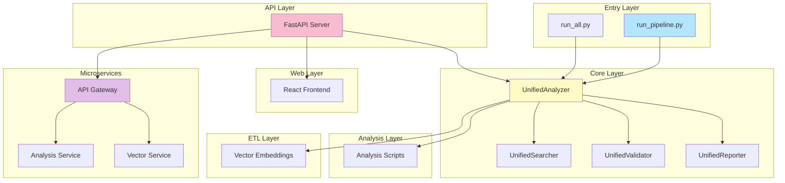
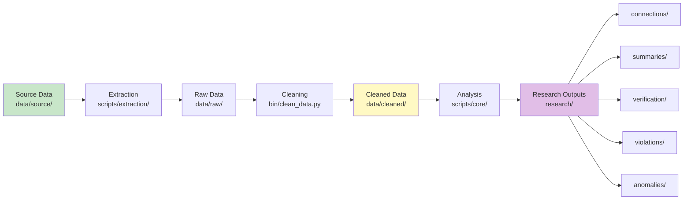

# System Analyst Guide


## System Purpose

Multi-state property management licensing investigation platform. Analyzes connections, violations, and anomalies across 50 states.

## Architecture Overview

| Aspect | Description |
|--------|-------------|
| **Type** | Python-first microservices architecture |
| **Pattern** | Unified modules + microservices + API + Web frontend |
| **Language** | Python (primary), R (deprecated) |

## Component Map



## Data Flow



## Key Components

<details>
<summary><b>UnifiedAnalyzer</b></summary>

**Input:** Source Data
**Operations:** Analysis operations
**Output:** Results

**Features:**
- ✅ Connection analysis
- ✅ Pattern detection
- ✅ Anomaly identification

</details>

<details>
<summary><b>UnifiedSearcher</b></summary>

**Input:** Queries
**Operations:** Search operations
**Output:** Results

**Features:**
- ✅ Multi-state license searches
- ✅ Database queries
- ✅ Web scraping

</details>

<details>
<summary><b>UnifiedValidator</b></summary>

**Input:** Data
**Operations:** Validation
**Output:** Validation reports

**Features:**
- ✅ Schema validation
- ✅ FK/PK integrity checks
- ✅ Data quality reports

</details>

## Entry Points

| Script | Purpose | Output |
|--------|---------|--------|
| `bin/run_pipeline.py` | Full pipeline | All outputs |
| `bin/run_all.py` | All analyses | Research outputs |
| `bin/analyze_connections.py` | Connections | `research/connections/` |
| `bin/validate_data.py` | Validation | `research/verification/` |

## Data Organization

<details>
<summary><b>Source Data</b> (`data/source/`)</summary>

- `skidmore_all_firms_complete.json` - 38 firms
- `skidmore_individual_licenses.json` - Individual licenses

</details>

<details>
<summary><b>Cleaned Data</b> (`data/cleaned/`)</summary>

- `firms.json` - Cleaned firm data
- `individual_licenses.json` - Cleaned license data

</details>

<details>
<summary><b>Research Outputs</b> (`research/`)</summary>

- `connections/` - Connection analyses
- `violations/` - Violation findings
- `anomalies/` - Anomaly reports
- `evidence/` - Evidence summaries
- `verification/` - Verification results
- `summaries/` - Summary reports
- `timelines/` - Timeline analyses

</details>

## Quick Reference

**Run Pipeline:**
```bash
python bin/run_pipeline.py
```

**Validate Schema:**
```bash
python scripts/utils/validate_schema.py --file data/cleaned/firms.json
```

**Load Data:**
```python
from scripts.core import UnifiedAnalyzer
analyzer = UnifiedAnalyzer()
analyzer.load_all_data()
```

## Related Documentation

- [System Architecture](SYSTEM_ARCHITECTURE.md) - Architecture details
- [Data Flow](DATA_FLOW.md) - Pipeline documentation
- [Components](COMPONENTS.md) - Component reference
- [Repository Structure](REPOSITORY_STRUCTURE.md) - Structure details
