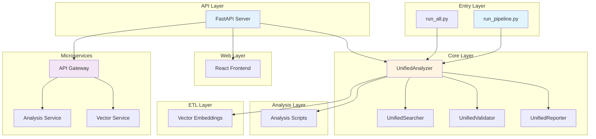
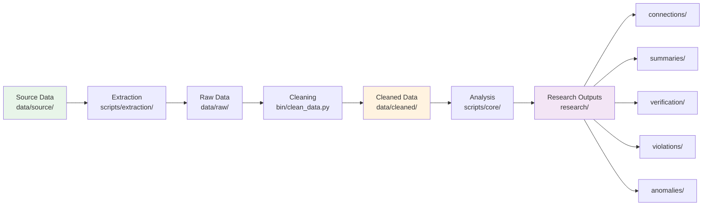
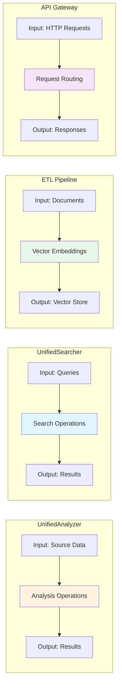

# System Analyst Guide

## System Purpose

Multi-state property management licensing investigation platform. Analyzes connections, violations, and anomalies across 50 states.

## Architecture Overview

**Type:** Python-first microservices architecture
**Pattern:** Unified modules + microservices + API + Web frontend

## Component Map

## Data Flow

## Key Components

**UnifiedAnalyzer** (`scripts/core/unified_analysis.py`)
- Purpose: Analysis operations
- Input: Source data, evidence
- Output: Analysis results

**UnifiedSearcher** (`scripts/core/unified_search.py`)
- Purpose: Search operations
- Input: Search queries
- Output: Search results

**ETL Pipeline** (`scripts/etl/etl_pipeline.py`)
- Purpose: Vector embeddings
- Input: Documents
- Output: Vector store

**API Gateway** (`microservices/api-gateway/`)
- Purpose: Request routing
- Input: HTTP requests
- Output: Service responses

## Entry Points

1. **Pipeline:** `bin/run_pipeline.py`
2. **All Analyses:** `bin/run_all.py`
3. **API:** `api/server.py`
4. **Web:** `web/` (npm run dev)

## Data Locations

**Source:** `data/source/`
**Raw:** `data/raw/` (gitignored)
**Cleaned:** `data/cleaned/` (gitignored)
**Research:** `research/`
**Research:** `research/{category}/`

## Configuration

**State Registry:** `config/state_dpor_registry.csv`
**Environment:** `.env`
**Docker:** `docker-compose.yml`
**Kubernetes:** `kubernetes/`

## Testing

**Unit Tests:** `tests/`
**Microservice Tests:** `microservices/tests/`
**Run:** `python -m pytest tests/`

## Deployment

**Local:** `python bin/run_pipeline.py`
**Docker:** `make up`
**Kubernetes:** `kubectl apply -f kubernetes/`

## Documentation

- [SYSTEM_ARCHITECTURE.md](SYSTEM_ARCHITECTURE.md) - Architecture details
- [DATA_FLOW.md](DATA_FLOW.md) - Data pipeline
- [COMPONENTS.md](COMPONENTS.md) - Component reference
- [API_REFERENCE.md](API_REFERENCE.md) - API endpoints
- [DEPLOYMENT.md](DEPLOYMENT.md) - Deployment guide
