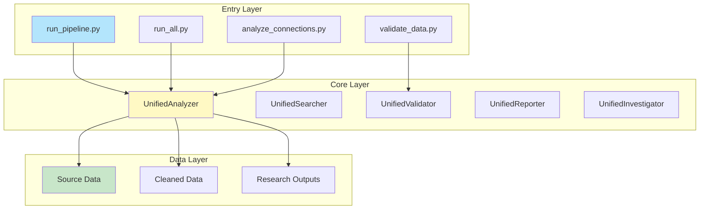
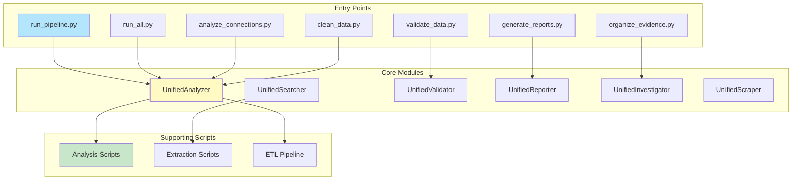
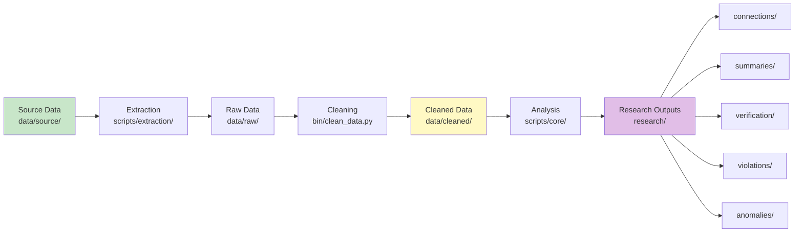
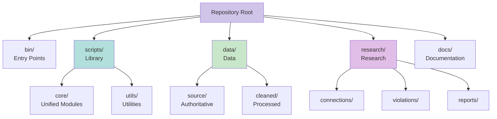
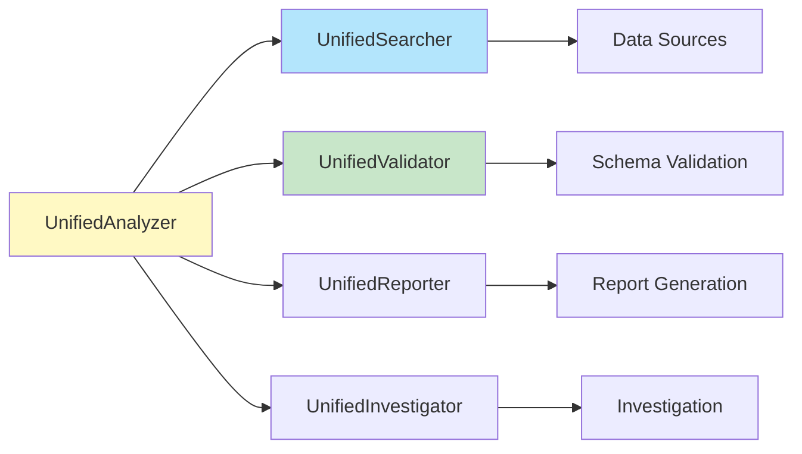
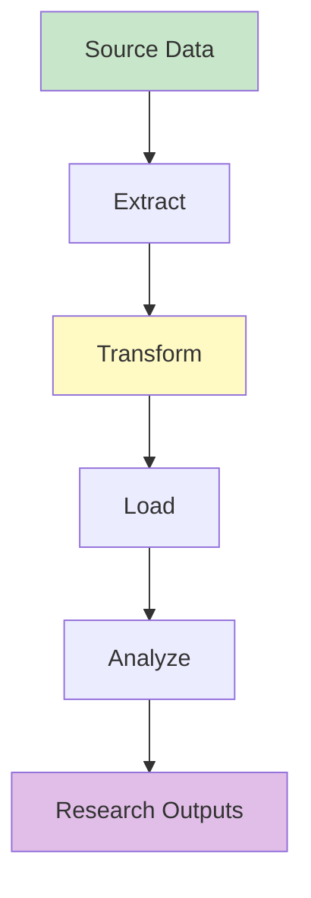

# System Architecture


Complete system architecture documentation including components, data flow, repository structure, and visual diagrams.

## Overview

Multi-state property management licensing investigation platform with Python-first architecture, unified core modules, and comprehensive data governance.

| Aspect | Description |
|--------|-------------|
| **Type** | Python-first microservices architecture |
| **Pattern** | Unified modules + microservices + API + Web frontend |
| **Language** | Python 3.14+ (primary), R (deprecated) |
| **Data Flow** | Source → Extract → Clean → Analyze → Research Outputs |

---

## Architecture diagram



---

## Component hierarchy



---

## Data flow pipeline



### Processing steps

1. **Source Data** (`data/source/`)
   - Authoritative data from Virginia DPOR and multi-state searches
   - 38 firms, 40+ individual licenses

2. **Extraction** (`scripts/extraction/`)
   - PDF text extraction
   - Excel data extraction
   - Entity extraction

3. **Raw Data** (`data/raw/`)
   - Unprocessed search results
   - Temporary storage

4. **Cleaning** (`bin/clean_data.py`)
   - Name standardization
   - Address normalization
   - Date parsing
   - Deduplication

5. **Cleaned Data** (`data/cleaned/`)
   - Validated, normalized data
   - Ready for analysis

6. **Analysis** (`scripts/core/`)
   - Connection analysis
   - Violation detection
   - Anomaly identification

7. **Research Outputs** (`research/`)
   - Connections, violations, anomalies
   - Evidence summaries
   - Complaint packages

---

## Repository structure



### Directory organization

**Entry Points** (`bin/`)
- `run_pipeline.py` - Full pipeline execution
- `run_all.py` - All analyses
- `analyze_connections.py` - Connection analysis
- `validate_data.py` - Data validation
- `generate_reports.py` - Report generation
- `organize_evidence.py` - Evidence organization
- `clean_data.py` - Data cleaning

**Scripts** (`scripts/`)
- `core/` - Unified modules (Analyzer, Searcher, Validator, Reporter, Investigator)
- `utils/` - Utility functions (paths, validation, metadata)
- `etl/` - ETL pipeline for vector embeddings

**Data** (`data/`)
- `source/` - Authoritative source data
- `cleaned/` - Cleaned and validated data
- `vectors/` - Vector embeddings
- Schema and metadata files

**Research** (`research/`)
- `connections/` - Connection analyses
- `violations/` - Violation findings
- `reports/` - Summary reports
- `va_dpor_complaint/` - Complaint package
- `license_searches/` - Multi-state search results

**Documentation** (`docs/`)
- System documentation
- Architecture guides
- Documentation index

---

## Key components

<details>
<summary><b>UnifiedAnalyzer</b> (`scripts/core/unified_analysis.py`)</summary>

**Purpose:** Unified analysis module consolidating multiple analysis scripts.

**Features:**
- Fraud pattern analysis
- Nexus pattern analysis
- Timeline analysis
- Anomaly consolidation
- Evidence analysis
- Connection matrix creation
- Shared resources analysis

**Input:** Source and cleaned data  
**Output:** Analysis results in `research/`

</details>

<details>
<summary><b>UnifiedInvestigator</b> (`scripts/core/unified_investigation.py`)</summary>

**Purpose:** Unified investigation module for regulatory compliance investigations.

**Features:**
- UPL investigation
- STR regulations research
- Zoning compliance checks
- Management chain audits

**Input:** Research data and evidence  
**Output:** Investigation results

</details>

<details>
<summary><b>SchemaValidator</b> (`scripts/utils/validate_schema.py`)</summary>

**Purpose:** Validates data against JSON Schema definitions.

**Features:**
- JSON Schema validation (Draft-07)
- FK/PK integrity checks
- Field validation
- Quality reporting

**Input:** Data files  
**Output:** Validation reports

</details>

---

## Entry points

| Script | Purpose | Output |
|--------|---------|--------|
| `bin/run_pipeline.py` | Full pipeline | All outputs |
| `bin/run_all.py` | All analyses | Research outputs |
| `bin/analyze_connections.py` | Connections | `research/connections/` |
| `bin/validate_data.py` | Validation | `research/verification/` |
| `bin/generate_reports.py` | Reports | `research/reports/` |

---

## Data organization

### Data structure

All data follows normalized schema with **Primary Keys (PK)** and **Foreign Keys (FK)**:

```
FIRMS {
    string firm_license PK
    string firm_name
    string principal_broker
    string individual_license FK
}

INDIVIDUAL_LICENSES {
    string license_number PK
    string name
    string state
}

CONNECTIONS {
    string connection_id PK
    string firm_license FK
    string license_number FK
    string connection_type
}
```

> 📘 See [data/schema.json](../data/schema.json) for complete schema definition and [data/DATA_DICTIONARY.md](../data/DATA_DICTIONARY.md) for field definitions.

### Data governance

The repository follows industry best practices for data governance:

- **[Data Catalog](../data/DATA_CATALOG.md)** - Comprehensive catalog of all data assets
- **[Data Governance](../data/GOVERNANCE.md)** - Governance framework including policies, roles, compliance
- **Data Classification** - Public, Internal, Confidential, Restricted levels
- **Quality Management** - Quality metrics, monitoring, and improvement processes

---

## System diagrams

### Component relationships



### Data transformation pipeline



---

## Documentation connections

This document connects to:
- 📋 [Data Dictionary](../data/DATA_DICTIONARY.md) - Field definitions
- 📊 [Schema](../data/schema.json) - Complete schema
- 📚 [Data Catalog](../data/DATA_CATALOG.md) - Data asset catalog and discoverability
- 🛡️ [Data Governance](../data/GOVERNANCE.md) - Governance framework and policies
- 🔄 [Documentation Index](INDEX.md) - Complete documentation index
- 📁 [Repository Structure](REPOSITORY_STRUCTURE.md) - File organization
- 📑 [Documentation Graph](DOCUMENTATION_GRAPH.md) - Complete documentation network

---

**Last Updated:** 2025-12-10  
**Architecture Version:** 1.0.0
