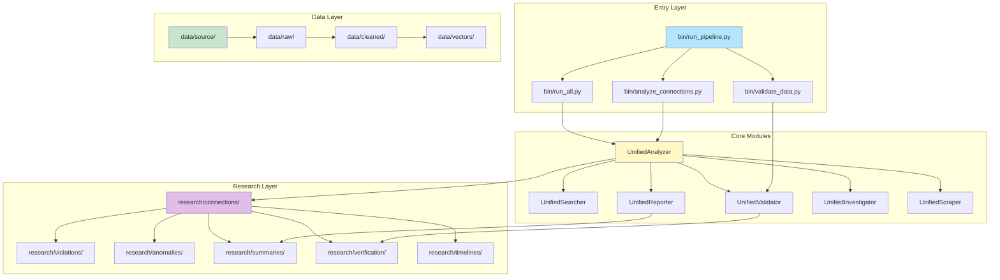
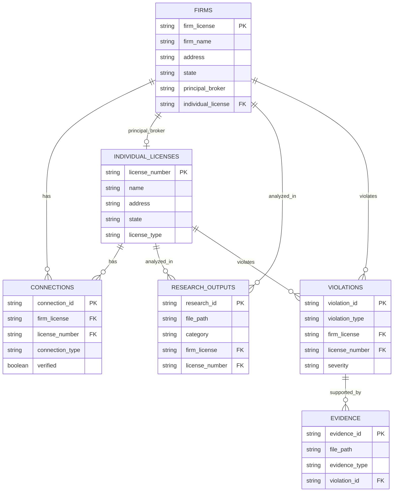

# System Architecture

## Overview

Python-first data analysis platform with microservices architecture.

## Architecture Diagram



## Components

```
┌─────────────────────────────────────────────────────────┐
│                    Entry Layer                           │
│  bin/run_pipeline.py, bin/run_all.py                    │
└────────────────────┬──────────────────────────────────┘
                      │
        ┌─────────────┼─────────────┐
        │             │             │
┌───────▼──────┐ ┌───▼──────┐ ┌───▼──────┐
│   Core        │ │   API    │ │   Web    │
│   Modules     │ │  Server  │ │   App    │
│               │ │          │ │          │
│ unified_*     │ │ FastAPI  │ │ React    │
└───────┬───────┘ └────┬─────┘ └────┬─────┘
        │              │             │
        └──────────────┼─────────────┘
                       │
        ┌──────────────┼──────────────┐
        │              │              │
┌───────▼──────┐ ┌────▼──────┐ ┌─────▼──────┐
│   Analysis    │ │   ETL     │ │ Microservices│
│   Layer       │ │  Pipeline │ │             │
│               │ │           │ │             │
│ scripts/      │ │ vectors/  │ │ api-gateway │
│ analysis/     │ │           │ │ analysis-*  │
└───────┬───────┘ └─────┬─────┘ └─────┬──────┘
        │                │             │
        └────────────────┼────────────┘
                          │
                ┌─────────▼─────────┐
                │   Data Layer       │
                │                    │
                │ data/source/       │
                │ data/raw/          │
                │ data/cleaned/      │
                │ research/          │
                │ research/          │
                └────────────────────┘
```

## Layers

**Entry Layer** (`bin/`)
- Entry point scripts
- Pipeline orchestration

**Core Layer** (`scripts/core/`)
- UnifiedAnalyzer
- UnifiedSearcher
- UnifiedValidator
- UnifiedReporter

**Analysis Layer** (`scripts/analysis/`)
- Analysis scripts
- Pattern detection

**ETL Layer** (`scripts/etl/`)
- Vector embeddings
- Data transformation

**API Layer** (`api/`)
- FastAPI REST API
- Endpoints for all operations

**Web Layer** (`web/`)
- React frontend
- Interactive analysis

**Microservices** (`microservices/`)
- API Gateway
- Analysis Service
- Vector Service
- Validation Service

**Data Layer** (`data/`, `research/`)
- Source data
- Processed data
- Analysis outputs

## Data Flow

```
Source Data → Extraction → Cleaning → Analysis → Research Outputs
     ↓            ↓           ↓          ↓            ↓
  data/      scripts/    data/     scripts/    research/
  source/    extraction/ cleaned/  analysis/   {category}/
```

## Component Responsibilities

**UnifiedAnalyzer** - Analysis operations
**UnifiedSearcher** - Search operations
**UnifiedValidator** - Data validation
**UnifiedReporter** - Report generation
**ETL Pipeline** - Vector embeddings and transformation
**API Gateway** - Request routing
**Analysis Service** - Distributed analysis

## Integration Points

- Core modules → Data layer
- API → Core modules
- Web → API
- Microservices → Core modules
- ETL → Vector storage

## Data Schema (ER Diagram)



See [data/schema.json](../data/schema.json) for complete schema definition and [data/DATA_DICTIONARY.md](../data/DATA_DICTIONARY.md) for field definitions.
