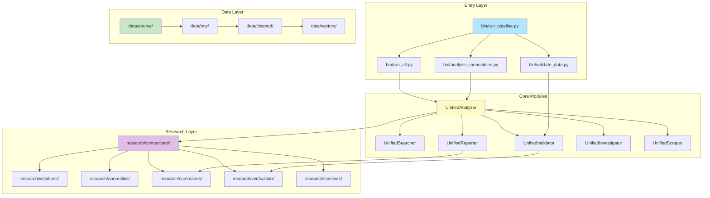
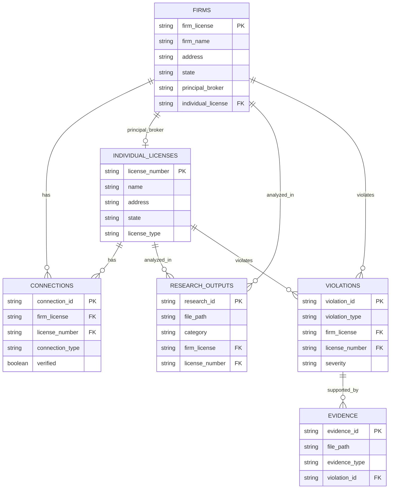

# System Architecture

## Overview

Python-first data analysis platform with microservices architecture.

## Architecture Diagram

## Layers

<b>Entry Layer</b> (`bin/`)

- Entry point scripts
- Pipeline orchestration

**Scripts:**
- `run_pipeline.py` - Full pipeline
- `run_all.py` - All analyses
- `analyze_connections.py` - Connections
- `validate_data.py` - Validation

<b>Core Layer</b> (`scripts/core/`)

- UnifiedAnalyzer - Analysis operations
- UnifiedSearcher - Search operations
- UnifiedValidator - Validation
- UnifiedReporter - Report generation
- UnifiedInvestigator - Investigation
- UnifiedScraper - Web scraping

<b>Analysis Layer</b> (`scripts/analysis/`)

- Analysis scripts
- Pattern detection
- Fraud analysis

<b>ETL Layer</b> (`scripts/etl/`)

- Vector embeddings
- Data transformation
- Pipeline orchestration

<b>API Layer</b> (`api/`)

- FastAPI REST API
- Endpoints for all operations
- Interactive API docs

<b>Web Layer</b> (`web/`)

- React frontend
- Interactive analysis
- Data visualization

<b>Microservices</b> (`microservices/`)

- API Gateway
- Analysis Service
- Vector Service
- Validation Service

<b>Data Layer</b> (`data/`, `research/`)

- Source data
- Processed data
- Analysis outputs

## Component Responsibilities

| Component | Responsibility |
|-----------|---------------|
| **UnifiedAnalyzer** | Analysis operations |
| **UnifiedSearcher** | Search operations |
| **UnifiedValidator** | Data validation |
| **UnifiedReporter** | Report generation |
| **ETL Pipeline** | Vector embeddings and transformation |
| **API Gateway** | Request routing |
| **Analysis Service** | Distributed analysis |

## Integration Points

- Core modules → Data layer
- API → Core modules
- Web → API
- Microservices → Core modules
- ETL → Vector storage

## Data Schema (ER Diagram)

> 📘 See [data/schema.json](../data/schema.json) for complete schema definition and [data/DATA_DICTIONARY.md](../data/DATA_DICTIONARY.md) for field definitions.
