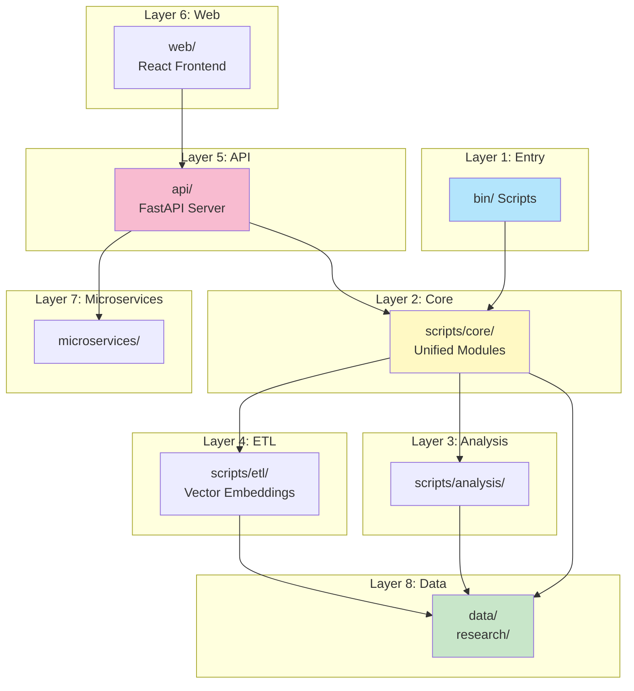
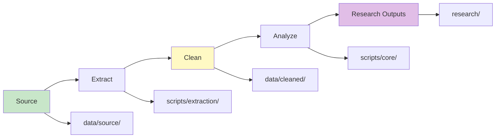

# System Overview

## Purpose

Multi-state property management licensing investigation platform.

## Architecture Layers

1. **Entry Layer** - `bin/` scripts
2. **Core Layer** - `scripts/core/` unified modules
3. **Analysis Layer** - `scripts/analysis/`
4. **ETL Layer** - `scripts/etl/`
5. **API Layer** - `api/`
6. **Web Layer** - `web/`
7. **Microservices** - `microservices/`
8. **Data Layer** - `data/`, `research/`

## Key Components

**UnifiedAnalyzer** - Analysis operations
**UnifiedSearcher** - Search operations
**UnifiedValidator** - Validation
**ETL Pipeline** - Vector embeddings
**API Gateway** - Request routing
**Analysis Service** - Distributed processing

## Data Flow

**Text Flow:**

Source → Extract → Clean → Analyze → Research Outputs

## Entry Points

- `bin/run_pipeline.py` - Full pipeline
- `bin/run_all.py` - All analyses
- `api/server.py` - API server
- `web/` - Web application
