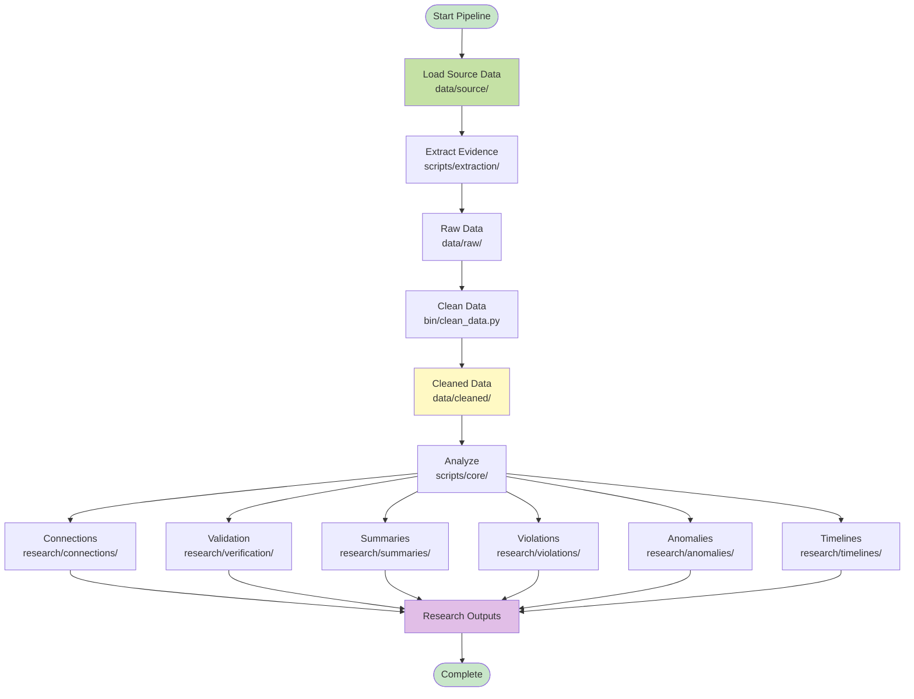
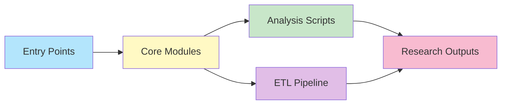
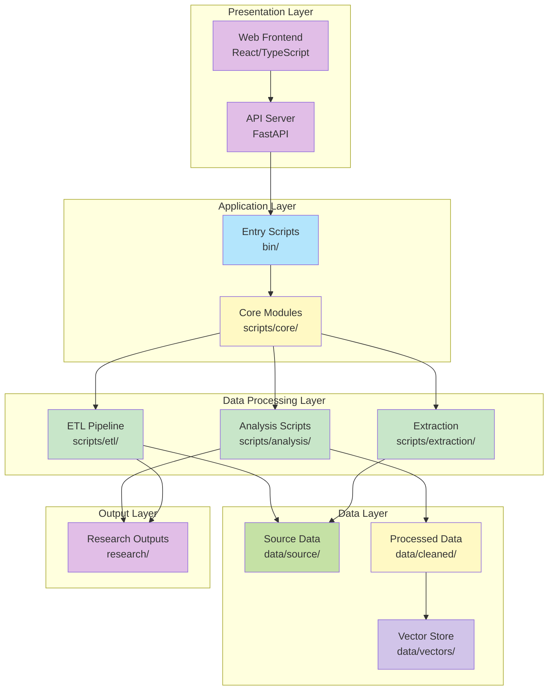
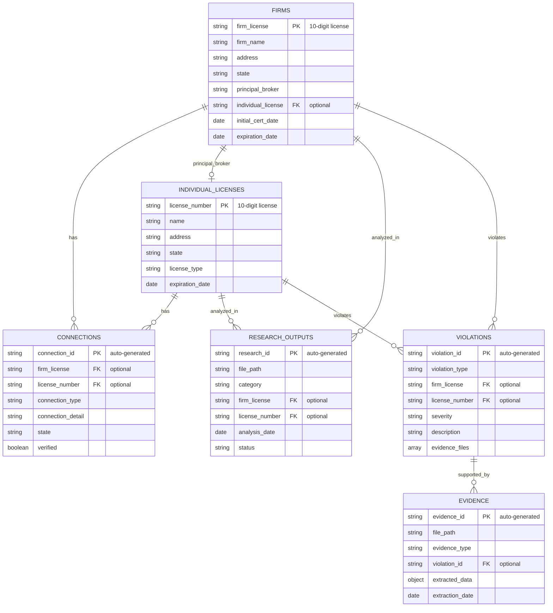

# Repository Diagrams

Visual representations of the repository structure, data flow, and system architecture.

## Repository Structure

```mermaid
graph TB
    subgraph "Repository Root"
        ROOT[kettler-data-analysis]
    end

    subgraph "Entry Points"
        ROOT --> BIN[bin/<br/>Python Entry Scripts]
    end

    subgraph "Code Library"
        ROOT --> SCRIPTS[scripts/]
        SCRIPTS --> CORE[core/<br/>Unified Modules]
        SCRIPTS --> ANALYSIS[analysis/<br/>Analysis Scripts]
        SCRIPTS --> EXTRACTION[extraction/<br/>Evidence Extraction]
        SCRIPTS --> ETL[etl/<br/>ETL Pipeline]
        SCRIPTS --> UTILS[utils/<br/>Path Utilities]
    end

    subgraph "Data Directories"
        ROOT --> DATA[data/]
        DATA --> SOURCE[source/<br/>Authoritative Data]
        DATA --> RAW[raw/<br/>Raw Search Results]
        DATA --> CLEANED[cleaned/<br/>Cleaned Data]
        DATA --> SCRAPED[scraped/<br/>Scraped Data]
        DATA --> VECTORS[vectors/<br/>Vector Embeddings]
    end

    subgraph "Research Outputs"
        ROOT --> RESEARCH[research/]
        RESEARCH --> CONNECTIONS[connections/<br/>Connection Analyses]
        RESEARCH --> VIOLATIONS[violations/<br/>Violation Findings]
        RESEARCH --> ANOMALIES[anomalies/<br/>Anomaly Reports]
        RESEARCH --> EVIDENCE[evidence/<br/>Evidence Summaries]
        RESEARCH --> VERIFICATION[verification/<br/>Verification Results]
        RESEARCH --> SUMMARIES[summaries/<br/>Summary Reports]
        RESEARCH --> TIMELINES[timelines/<br/>Timeline Analyses]
        RESEARCH --> SEARCH[search_results/<br/>Search Results]
    end

    subgraph "Services"
        ROOT --> API[api/<br/>FastAPI Server]
        ROOT --> WEB[web/<br/>React Frontend]
        ROOT --> MICRO[microservices/<br/>Microservice Impl]
    end

    style ROOT fill:#D1C4E9,stroke:#9575CD,stroke-width:3px
    style DATA fill:#C8E6C9,stroke:#81C784
    style RESEARCH fill:#E1BEE7,stroke:#BA68C8
    style SCRIPTS fill:#B2DFDB,stroke:#4DB6AC
    style BIN fill:#B3E5FC,stroke:#4FC3F7
```

## Data Flow Pipeline

## Component Relationships

## System Architecture Layers

## Entity-Relationship Diagram (FK/PK Relationships)

## Usage

<b>Viewing Diagrams</b>

These diagrams are rendered automatically in:
- ✅ GitHub (native Mermaid support)
- ✅ GitLab (native Mermaid support)
- ✅ VS Code (with Mermaid extension)
- ✅ Most modern markdown viewers

To view locally, use a markdown viewer that supports Mermaid.js or visit the repository on GitHub/GitLab.

## Related

- [System Architecture](../SYSTEM_ARCHITECTURE.md) - Complete architecture
- [Repository Structure](../REPOSITORY_STRUCTURE.md) - Structure details
