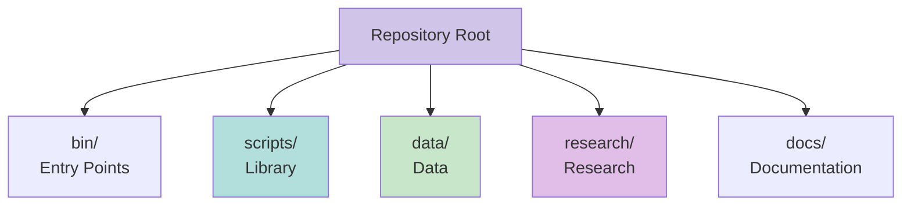

# Organization


## Repository Structure



## Directory Organization

<details>
<summary><b>Entry Points</b> (`bin/`)</summary>

Python scripts to run the system.

- `run_pipeline.py` - Full pipeline
- `run_all.py` - All analyses
- `analyze_connections.py` - Connections
- `validate_data.py` - Validation

</details>

<details>
<summary><b>Scripts</b> (`scripts/`)</summary>

Library code organized by function.

- `core/` - Unified modules
- `analysis/` - Analysis scripts
- `extraction/` - Evidence extraction
- `etl/` - ETL pipeline
- `utils/` - Utilities

</details>

<details>
<summary><b>Data</b> (`data/`)</summary>

Data files organized by stage.

- `source/` - Authoritative data
- `raw/` - Raw results (gitignored)
- `cleaned/` - Cleaned data (gitignored)
- `vectors/` - Vector embeddings

</details>

<details>
<summary><b>Research</b> (`research/`)</summary>

Research outputs organized by category.

- `connections/` - Connection analyses
- `violations/` - Violation findings
- `anomalies/` - Anomaly reports
- `evidence/` - Evidence summaries
- `verification/` - Verification results
- `summaries/` - Summary reports
- `timelines/` - Timeline analyses

</details>

<details>
<summary><b>Documentation</b> (`docs/`)</summary>

System documentation and guides.

- System architecture
- Data flow
- Components
- Guides
- Reference materials

</details>

## Data Flow

```
Source → Extract → Clean → Analyze → Research Outputs
```

> 📘 See [System Architecture](../SYSTEM_ARCHITECTURE.md) for complete architecture documentation.

## Related

- [Repository Structure](REPOSITORY_STRUCTURE.md) - Detailed structure
- [System Architecture](SYSTEM_ARCHITECTURE.md) - Architecture details
- [System Architecture](../SYSTEM_ARCHITECTURE.md) - Complete architecture (includes components)
