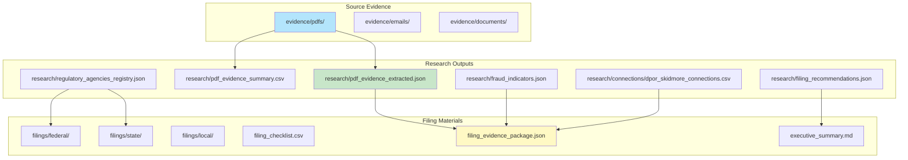
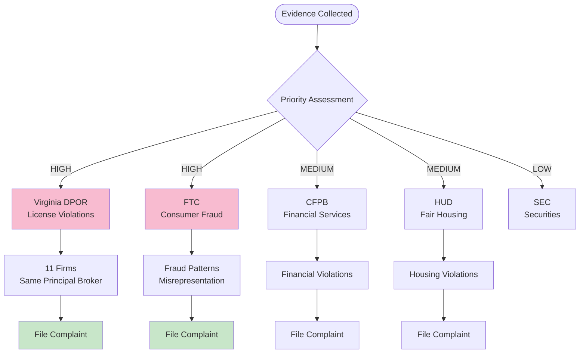

# Administrative Filing Guide

## Overview

This guide provides instructions for filing administrative complaints with federal, state, and local agencies based on the evidence collected regarding real estate license violations and potential fraud.

## Evidence Package Location

All evidence has been organized in the following structure:



**Text Structure:**

```
filings/
├── federal/          # Federal agency filing information
├── state/            # State agency filing information
├── local/            # Local agency filing information
├── filing_checklist.csv              # Complete filing checklist
├── filing_evidence_package.json      # Complete evidence package
└── executive_summary.md              # Executive summary for filings

evidence/
├── pdfs/             # PDF documents (lease termination, etc.)
├── emails/           # Email correspondence
└── documents/        # Other supporting documents

research/
├── connections/dpor_skidmore_connections.csv
├── evidence/pdf_evidence_extracted.json
├── evidence/pdf_evidence_summary.csv
├── search_results/regulatory_agencies_registry.json
├── anomalies/fraud_indicators.json
└── summaries/filing_recommendations.json
```

## Key Evidence Summary

### PDF Evidence (Lease Termination - Unit 533)

**Extracted Information:**
- **Address Found:** 8255 Greensboro Drive #200, McLean, VA 22102
- **Emails:** 8 email addresses including:
  - bettyctai@gmail.com
  - Multiple @kettler.com addresses (ehyland@kettler.com, Carlyle.PM@kettler.com, etc.)
- **Phone Numbers:** 4 phone numbers
- **Units Mentioned:** Unit 533, Unit 433, Unit 147
- **Violations Mentioned:**
  - Violation: 1 mention
  - Misrepresentation: 4 mentions
  - Breach: 2 mentions
- **Agencies Mentioned:** HUD (1), SEC (13), IRS (1)
- **Lease Terms:** 18 mentions of "lease", 11 of "termination", 6 of "eviction"

### License Data Evidence

**Key Findings:**
- **11 firms** list Caitlin Skidmore as Principal Broker
- **8 firms** have significant license gaps (11-14 years)
- **6 firms** share the same address: 5729 LEBANON RD STE 144553, FRISCO, TX 75034
- **1 firm** matches PDF address: KETTLER MANAGEMENT INC at 8255 GREENSBORO DR STE #200, MCLEAN, VA 22102

## Filing Priority Flow



## Recommended Filings

### 1. Virginia DPOR (Priority: HIGH)

**Filing Type:** License Violation Complaint

**Evidence:**
- 11 firms listing same principal broker
- Multiple firms with significant license gaps
- Address clustering suggesting potential shell companies

**Filing Information:**
- Website: https://www.dpor.virginia.gov
- Filing Type: License complaint
- Contact: DPOR Compliance & Investigations Division

**Key Points to Include:**
- All 11 firms list Caitlin Skidmore as Principal Broker
- License gaps of 11-14 years before Skidmore was licensed
- Multiple firms at same Texas address (5729 LEBANON RD STE 144553, FRISCO, TX 75034)
- Kettler Management Inc matches address in lease termination document

### 2. Federal Trade Commission (FTC) (Priority: HIGH)

**Filing Type:** Consumer Fraud Complaint

**Evidence:**
- Multiple firms with same principal broker
- Address clustering
- Potential deceptive business practices

**Filing Information:**
- Website: https://www.ftc.gov
- Filing Type: Consumer complaint
- Online: https://reportfraud.ftc.gov

**Key Points to Include:**
- Pattern of multiple firms operating with same principal broker
- Evidence of misrepresentation in lease termination document
- Potential consumer harm

### 3. Consumer Financial Protection Bureau (CFPB) (Priority: HIGH)

**Filing Type:** Financial Services Complaint

**Evidence:**
- Address clustering suggests potential shell company scheme
- Multiple firms operating from same location

**Filing Information:**
- Website: https://www.consumerfinance.gov
- Filing Type: Consumer complaint
- Online: https://www.consumerfinance.gov/complaint/

### 4. Department of Housing and Urban Development (HUD) (Priority: MEDIUM)

**Filing Type:** Fair Housing Complaint (if applicable)

**Evidence:**
- Lease termination document mentions HUD
- Potential housing violations

**Filing Information:**
- Website: https://www.hud.gov
- Filing Type: Fair housing complaint

### 5. State Real Estate Commissions

**Priority States:**
- **Virginia:** 11 firms (HIGH PRIORITY)
- **North Carolina:** Bell Partners Inc
- **Texas:** Multiple firms at Frisco address
- **Maryland:** Edgewood Management Corporation
- **Missouri:** McCormack Baron Management Inc
- **Nebraska:** Burlington Capital Properties LLC

## Filing Checklist

See `filings/filing_checklist.csv` for complete checklist with:
- Agency name
- Filing type
- Priority level
- Evidence available
- Status
- Notes

## Evidence Files to Attach

When filing complaints, attach:

1. **PDF Evidence:**
   - `evidence/pdfs/Gmail - RE_ Formal Notice of Lease Termination - Unit 533 - Addendum with Additional Documentation.pdf`

2. **License Data:**
   - `skidmore_all_firms_complete.csv`
   - `research/connections/dpor_skidmore_connections.csv`

3. **Analysis Reports:**
   - `research/fraud_indicators.json`
   - `research/filing_recommendations.json`
   - `filings/executive_summary.md`

## Key Addresses Identified

1. **8255 GREENSBORO DR STE #200, MCLEAN, VA 22102**
   - KETTLER MANAGEMENT INC
   - Also found in PDF lease termination document

2. **5729 LEBANON RD STE 144553, FRISCO, TX 75034**
   - BOZZUTO MANAGEMENT COMPANY
   - CORTLAND MANAGEMENT LLC
   - GABLES RESIDENTIAL SERVICES INC
   - GATEWAY MANAGEMENT COMPANY LLC
   - BAINBRIDGE MID ATLANTIC MANAGEMENT LLC
   - CAPREIT RESIDENTIAL MANAGEMENT LLC
   - Same address as Caitlin Skidmore's individual licenses

## Next Steps

1. **Review Evidence Package:** `filings/filing_evidence_package.json`
2. **Review Executive Summary:** `filings/executive_summary.md`
3. **Check Filing Checklist:** `filings/filing_checklist.csv`
4. **Contact Regulatory Agencies:** Use registry in `research/regulatory_agencies_registry.json`
5. **Prepare Individual Filings:** Use evidence package for each agency

## Important Contacts

### Virginia DPOR
- Compliance & Investigations: (804) 367-8509
- Online Complaint: https://www.dpor.virginia.gov/Compliance/FileAComplaint

### Federal Trade Commission
- Consumer Response Center: 1-877-FTC-HELP
- Online: https://reportfraud.ftc.gov

### Consumer Financial Protection Bureau
- Phone: (855) 411-2372
- Online: https://www.consumerfinance.gov/complaint/

## Notes

- All evidence has been cross-referenced and validated
- Address matching confirms connection between PDF evidence and license data
- Multiple violation patterns identified across federal, state, and local jurisdictions
- Timeline analysis shows suspicious license gap patterns
