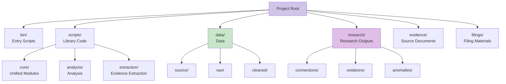
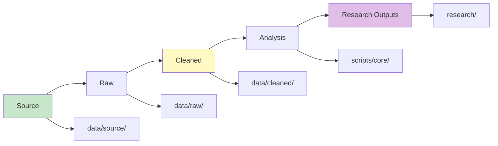

# Project Organization

## Structure



**Text Structure:**

```
bin/              # Entry scripts
scripts/          # Library code
  core/           # Unified modules
  analysis/       # Analysis
  extraction/     # Evidence extraction
data/             # Data
research/         # Outputs by category
evidence/         # Source documents
filings/          # Filing materials
```

## Data Flow



**Text Flow:**

Source → Raw → Cleaned → Analysis → Research Outputs

## Research Categories

- `connections/` - Connection analyses
- `violations/` - Violation findings
- `anomalies/` - Anomaly reports
- `evidence/` - Evidence summaries
- `verification/` - Verification results
- `timelines/` - Timeline analyses
