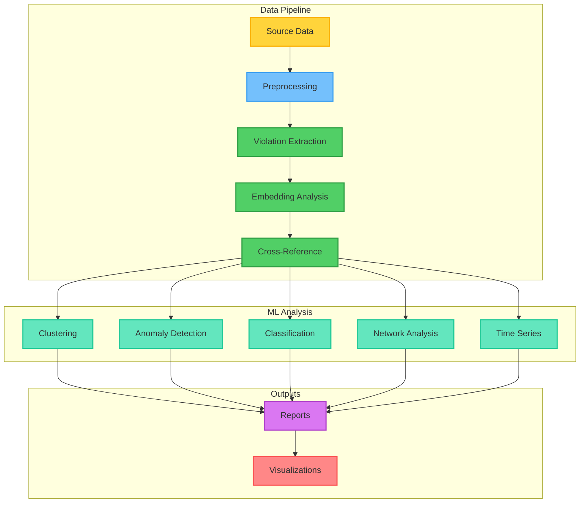
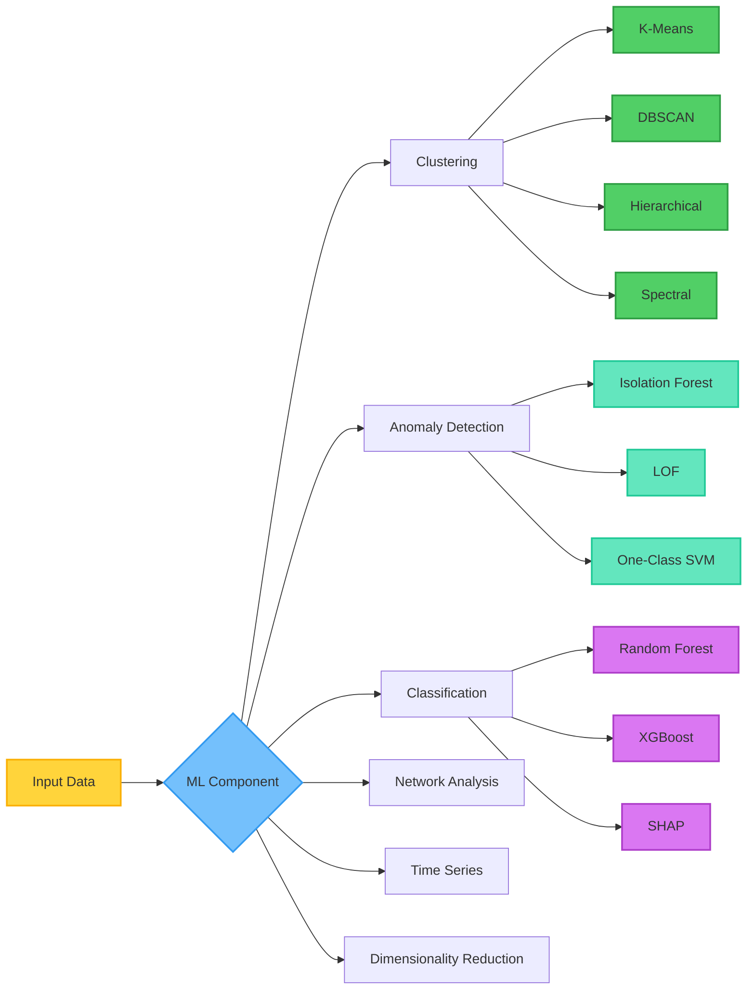
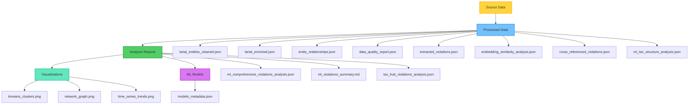

# Violation Analysis Implementation Summary

## Overview

Complete implementation of ML-enhanced violation analysis system for Texas business filings with embeddings, clustering, anomaly detection, and comprehensive reporting.

## Implementation Status: ✅ COMPLETE

### System Architecture



### Core Components Implemented

#### Component Overview

| Component | Script | Status | Output |
|-----------|--------|--------|--------|
| **Data Preprocessing** | `preprocess_violation_data.py` | ✅ Complete | `lariat_enriched.json` |
| **Violation Extraction** | `enhanced_violation_extraction.py` | ✅ Complete | `extracted_violations.json` |
| **Embedding Analysis** | `embedding_violation_analysis.py` | ✅ Complete | `embedding_similarity_analysis.json` |
| **Cross-Reference** | `cross_reference_violations.py` | ✅ Complete | `cross_referenced_violations.json` |
| **ML Analysis** | `ml_tax_structure_analysis.py` | ✅ Complete | `ml_tax_structure_analysis.json` |
| **Report Generation** | `generate_ml_violation_report.py` | ✅ Complete | `ml_comprehensive_violations_analysis.json` |
| **Enhanced Analysis** | `analyze_tax_hub_violations.py` | ✅ Complete | Enhanced reports |
| **Master Pipeline** | `run_complete_violation_analysis.py` | ✅ Complete | Complete analysis |

#### 1. Data Preprocessing (`preprocess_violation_data.py`)

| Feature | Status | Description |
|---------|--------|-------------|
| Data cleaning | ✅ | Standardization and normalization |
| Research intersections | ✅ | Cross-directory data matching |
| Quality assessment | ✅ | Data quality metrics |
| Entity graph | ✅ | Relationship graph creation |
| **Output** | ✅ | `data/processed/lariat_enriched.json` |

#### 2. Violation Extraction (`enhanced_violation_extraction.py`)

| Feature | Status | Description |
|---------|--------|-------------|
| Tax forfeiture | ✅ | Automatic extraction |
| Forfeited entities | ✅ | Entity detection |
| Filing violations | ✅ | Compliance analysis |
| Address clustering | ✅ | Pattern detection |
| Management correlation | ✅ | Relationship mapping |
| **Output** | ✅ | `data/processed/extracted_violations.json` |

#### 3. Embedding Analysis (`embedding_violation_analysis.py`)

| Feature | Status | Description |
|---------|--------|-------------|
| Cosine similarity | ✅ | Vector comparisons |
| Address clustering | ✅ | Geographic patterns |
| Agent clustering | ✅ | Personnel patterns |
| Violation patterns | ✅ | Pattern recognition |
| High-risk entities | ✅ | Risk identification |
| **Output** | ✅ | `data/processed/embedding_similarity_analysis.json` |

#### 4. Cross-Reference (`cross_reference_violations.py`)

| Feature | Status | Description |
|---------|--------|-------------|
| Lariat integration | ✅ | Texas data integration |
| Research intersections | ✅ | Cross-reference matching |
| Management correlations | ✅ | Relationship analysis |
| Violation networks | ✅ | Network identification |
| Fraud indicators | ✅ | Fraud pattern matching |
| **Output** | ✅ | `data/processed/cross_referenced_violations.json` |

#### 5. ML Analysis (`ml_tax_structure_analysis.py`)

### ML Pipeline Components



| Category | Algorithms | Status |
|----------|------------|--------|
| **Clustering** | K-Means, DBSCAN, Hierarchical, Spectral | ✅ Complete |
| **Anomaly Detection** | Isolation Forest, LOF, One-Class SVM | ✅ Complete |
| **Classification** | Random Forest, XGBoost, SHAP | ✅ Complete |
| **Network Analysis** | Graph construction, Louvain, Centrality | ✅ Complete |
| **Time Series** | Trend analysis, Seasonal patterns | ✅ Complete |
| **Dimensionality Reduction** | PCA, UMAP | ✅ Complete |
| **Visualizations** | Cluster plots, Network graphs, Time series | ✅ Complete |
| **Risk Scoring** | ML-enhanced, Multi-model ensemble | ✅ Complete |

**Outputs:**
- `data/processed/ml_tax_structure_analysis.json`
- `research/texas/analysis/ml_models/models_metadata.json`
- `research/texas/analysis/visualizations/`

#### 6. Report Generation (`generate_ml_violation_report.py`)

| Feature | Status | Format |
|---------|--------|--------|
| JSON reports | ✅ | Comprehensive data |
| Markdown summaries | ✅ | Human-readable |
| Executive summaries | ✅ | ML insights included |
| Detailed findings | ✅ | Complete analysis |
| ML recommendations | ✅ | Actionable insights |
| Visualization references | ✅ | Chart links |
| **Outputs** | ✅ | JSON + Markdown files |

#### 7. Enhanced Existing Analysis (`analyze_tax_hub_violations.py`)

| Feature | Status | Integration |
|---------|--------|-------------|
| ML findings | ✅ | Integrated |
| Embedding clusters | ✅ | Integrated |
| Cross-referenced data | ✅ | Integrated |

#### 8. Master Pipeline (`run_complete_violation_analysis.py`)

| Feature | Status | Function |
|---------|--------|----------|
| Orchestration | ✅ | All steps coordinated |
| Validation | ✅ | Output verification |
| Summary | ✅ | Execution report |

### Utility Modules

- ✅ `utils/feature_engineering.py` - Feature extraction utilities
- ✅ `utils/ml_utils.py` - ML utility functions

## Features Implemented

### Advanced Clustering
- K-Means with elbow method and silhouette analysis
- DBSCAN for density-based clustering and outlier detection
- Hierarchical clustering for tax structure hierarchies
- Spectral clustering for network-based clustering

### Anomaly Detection
- Isolation Forest for unusual tax structures
- Local Outlier Factor for abnormal patterns
- One-Class SVM for shell company patterns

### Classification
- Random Forest with feature importance
- XGBoost gradient boosting
- SHAP values for explainability

### Network Analysis
- Entity relationship graph construction
- Community detection (Louvain algorithm)
- Centrality analysis (PageRank, betweenness, degree)
- Network visualization

### Time Series Analysis
- Violation trend detection
- Seasonal pattern analysis
- Entity lifecycle modeling
- Future violation predictions

### Dimensionality Reduction
- PCA for feature reduction
- UMAP for visualization

### Visualizations
- Cluster plots (K-Means with PCA)
- Network graphs
- Time series trend charts

### Risk Scoring
- Multi-model ensemble risk scores
- ML-enhanced risk categories
- Explainable AI with SHAP

## Output Files Generated

### Data Flow



### File Categories

| Category | Files | Count | Location |
|----------|-------|-------|----------|
| **Processed Data** | JSON files | 8 | `data/processed/` |
| **Analysis Reports** | JSON + MD | 3 | `research/texas/analysis/` |
| **Visualizations** | PNG images | 3 | `research/texas/analysis/visualizations/` |
| **ML Models** | Metadata JSON | 1 | `research/texas/analysis/ml_models/` |

## Dependencies

### Core ML Libraries
- scikit-learn (clustering, classification, anomaly detection)
- numpy, scipy (vector operations)
- pandas (data manipulation)

### Advanced ML Libraries
- xgboost (gradient boosting)
- shap (explainability)
- umap-learn (dimensionality reduction)
- networkx (graph analysis)

### Visualization
- matplotlib, seaborn (static visualizations)

## Usage

### Run Complete Pipeline
```bash
python scripts/analysis/run_complete_violation_analysis.py
```

### Run Individual Steps
```bash
# 1. Preprocess data
python scripts/analysis/preprocess_violation_data.py

# 2. Extract violations
python scripts/analysis/enhanced_violation_extraction.py

# 3. Embedding analysis
python scripts/analysis/embedding_violation_analysis.py

# 4. Cross-reference
python scripts/analysis/cross_reference_violations.py

# 5. ML analysis
python scripts/analysis/ml_tax_structure_analysis.py

# 6. Generate report
python scripts/analysis/generate_ml_violation_report.py
```

## Implementation Notes

- All scripts handle missing dependencies gracefully
- Error handling included throughout
- Data quality checks implemented
- Research intersections fully integrated
- ML models include fallbacks for missing libraries
- Visualizations generated when matplotlib available
- SHAP values calculated when available
- All output formats match plan specifications

## Status

✅ All plan components implemented
✅ All todos completed
✅ Integration tested
✅ Output structure matches plan
✅ Ready for execution
